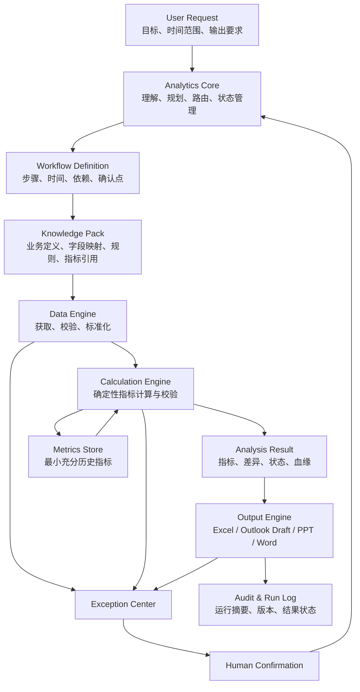
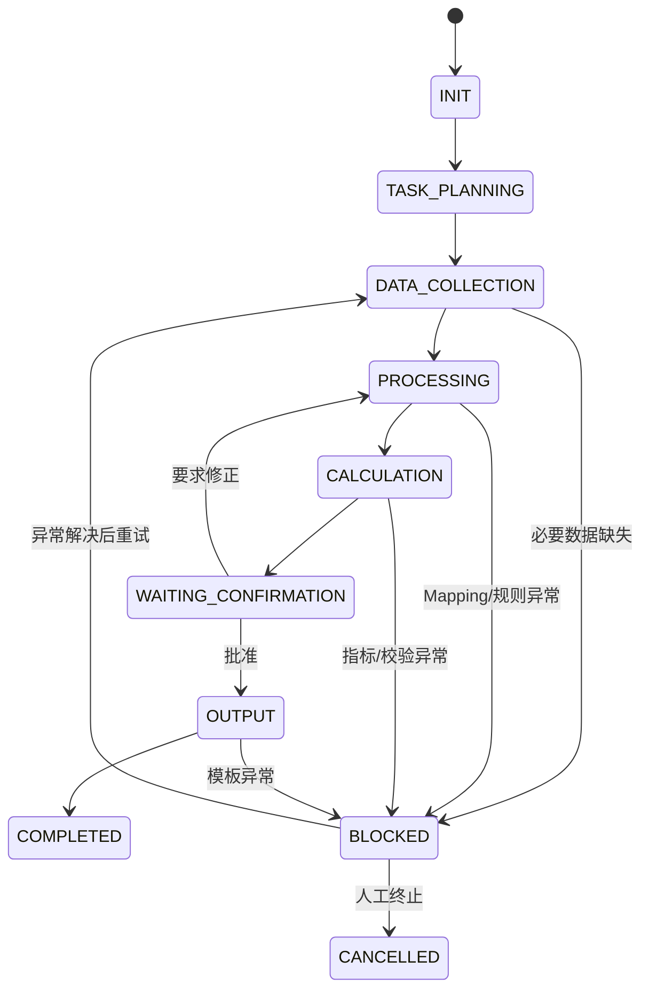

# Personal Business Analytics Copilot 架构设计方案 v1.0

> 阶段：方案评审
> 当前范围：只设计，不开发；只落地第一个 Workflow——Weekly Business Report
> 设计目标：长期运行、低成本、低维护、配置驱动、可追溯、可持续扩展

> 评审更新（2026-07-26）：整体架构、4 Skill 原则及 Weekly Business Report MVP 范围已确认。第 13 节事项已按 MVP 影响分级，后续以 [Phase 1 入口](phase1/INDEX.md) 为准。

## 0. 结论摘要

建议采用“**4 个稳定 Skill + 多个业务 Workflow + 按领域拆分的 Knowledge Pack + 轻量 Metrics Store**”的架构。

- **Skill** 只承载跨业务复用的稳定能力：任务编排、数据处理、指标计算、结果输出。
- **Workflow** 定义某个业务任务在什么时间、按什么顺序、使用哪些数据和模板、在哪些节点需要人工确认。
- **Knowledge Pack** 保存已经确认的业务知识，按收入、库存等业务领域拆分，避免每次让 AI 重新理解。
- **Metrics Store** 只保存后续比较所需的最小充分数据，不保存大体量原始文件。
- **Exception Center** 统一承接无法安全自动处理的问题；未知字段、规则冲突和口径变化不得由 Agent 自行猜测。
- **人工确认** 是 MVP 的必要控制点：收入结果确认后才能进入最终周报，邮件只生成 Draft，不自动发送。

这套方案的核心扩展方式是：新增月报或季报时，优先复用现有 Skill、指标和 Knowledge Pack，只新增或组合 Workflow 与模板。

---

## 1. Personal Business Analytics Copilot 整体架构

### 1.1 分层架构



### 1.2 核心组件

| 组件 | 保存什么 | 不保存什么 | 变化频率 |
|---|---|---|---|
| Analytics Core | 任务定义、Workflow 路由、运行状态 | 业务指标公式、输出模板细节 | 低 |
| Workflow | 业务步骤、依赖、时间、确认点、输入输出 | 通用清洗逻辑、指标公式 | 中 |
| Knowledge Pack | 已确认的业务定义、字段映射、业务规则、案例索引 | 全量聊天、未经确认的推测 | 中 |
| Data Engine | 通用获取与标准化能力 | 收入或库存专属业务知识 | 低 |
| Calculation Engine | 统一指标执行、比较、验证、血缘 | 场景流程、邮件措辞 | 低 |
| Metrics Store | 周期、维度、核心指标、必要基础值、版本 | 大型原始文件、无价值中间表 | 持续追加 |
| Output Engine | 模板渲染和格式输出 | 指标口径、业务判断 | 低 |
| Exception Center | 当前待处理异常和已解决案例索引 | 每次运行需加载的全量异常史 | 持续追加 |
| Run Log | 每次任务的时间、状态、输入引用、版本、输出引用 | 原始数据副本 | 持续追加 |

### 1.3 建议目录

```text
Business_Analytics_Copilot/
├── INDEX.md
├── governance/
│   ├── architecture.md
│   ├── naming_convention.md
│   ├── change_management.md
│   └── version_policy.md
├── skills/
│   ├── analytics_core/
│   ├── data_engine/
│   ├── calculation_engine/
│   └── output_engine/
├── workflows/
│   └── weekly_business_report/
│       ├── WORKFLOW.md
│       ├── workflow_config.yaml
│       ├── checkpoints.md
│       └── acceptance_criteria.md
├── knowledge_packs/
│   ├── revenue/
│   └── inventory/
├── metric_library/
│   ├── INDEX.md
│   ├── base_metrics/
│   └── derived_metrics/
├── metrics_store/
│   ├── current/
│   └── archive/
├── templates/
│   ├── excel/
│   ├── outlook/
│   ├── ppt/
│   └── word/
├── exceptions/
│   ├── OPEN.md
│   ├── resolved/
│   └── solved_cases/
├── analytics_memory/
│   ├── INDEX.md
│   └── approved_learnings/
└── logs/
    └── runs/
```

`INDEX.md` 是唯一默认入口，负责告诉 Agent：某类请求应读取哪个 Workflow、哪个 Knowledge Pack、哪些指标和模板。目录存在不代表每次全部加载。

---

## 2. Skill 职责边界

### 2.1 Analytics Core

**职责**

- 将用户自然语言转换成结构化任务定义。
- 识别任务类型并选择 Workflow。
- 检查必要输入、时间范围和输出要求是否完整。
- 驱动状态迁移、依赖检查和人工确认。
- 只向其他 Skill 传递当前步骤所需的最小上下文。
- 汇总运行结果与异常，不承担具体计算。

**输入**

- 用户请求。
- Workflow 索引与当前 Workflow 定义。
- 当前任务状态和异常状态。

**输出**

- Task Definition。
- Workflow 选择结果。
- 当前步骤指令。
- 任务状态和完成摘要。

**明确不负责**

- 不定义字段映射。
- 不编写或执行指标公式。
- 不直接修改业务规则。
- 不直接生成 Excel 或邮件正文。

### 2.2 Data Engine

**职责**

- 按数据源配置获取文件或数据。
- 执行文件名、时间、来源、格式和完整性检查。
- 根据批准的 `field_mapping` 完成字段标准化。
- 执行通用清洗：类型转换、空值标记、重复检测、日期标准化。
- 输出标准化数据和 Data Quality Report。
- 发现未知字段、缺失字段或无法映射字段时创建异常。

**明确不负责**

- 不猜测未知字段的业务含义。
- 不决定收入或库存的业务口径。
- 不计算业务指标。
- 不修改源文件作为唯一留痕。

### 2.3 Calculation Engine

**职责**

- 从 Metric Definition Library 读取已批准的指标定义。
- 执行基础指标、汇总指标、派生指标、环比、同比和趋势计算。
- 执行验证规则和对账规则。
- 为每个结果生成 Calculation Lineage。
- 将批准保存的结果写入 Metrics Store。

**明确不负责**

- 不从邮件文本临时发明指标公式。
- 不把指标逻辑写进 Workflow。
- 不在口径冲突时自行选择一个版本。
- 不决定输出样式。

### 2.4 Output Engine

**职责**

- 根据输出任务选择模板和模板版本。
- 将已验证的指标及分析结论填入 Excel、Outlook Draft、PPT 或 Word。
- 检查必填区、格式、单位、日期和文件命名。
- 生成输出清单和模板校验结果。

**明确不负责**

- 不重新计算指标。
- 不修改已批准的业务口径。
- 不自动发送邮件。
- 不用自然语言“修正”上游数据异常。

### 2.5 边界判定规则

遇到新需求时，用下面四个问题判断归属：

1. 它是否是多个业务都会复用的稳定能力？是，则可能属于 Skill。
2. 它是否描述某个任务的步骤、时间或确认点？是，则属于 Workflow。
3. 它是否是已经确认的业务含义、字段或规则？是，则属于 Knowledge Pack。
4. 它是否是一个可重复计算的量化定义？是，则属于 Metric Library。

---

## 3. Workflow 设计方式

### 3.1 Workflow 的标准组成

每个 Workflow 至少包含：

| 模块 | 内容 |
|---|---|
| Identity | Workflow_ID、名称、版本、Owner、状态 |
| Trigger | 手动触发、定时触发、补跑条件 |
| Request Contract | 目标、时间范围、输出要求、默认值 |
| Inputs | 数据源、文件规则、依赖指标、历史周期 |
| Steps | 顺序、负责 Skill、输入、输出、超时和重试规则 |
| Checkpoints | 哪些步骤必须人工确认，谁确认，确认什么 |
| Exceptions | 可能异常、处理方式、是否允许继续 |
| Outputs | 文件、Draft、指标和日志 |
| Versions | Workflow、Rule、Mapping、Metric、Template 版本 |
| Acceptance Criteria | 何时算成功、失败、部分完成 |

### 3.2 状态模型

建议将原始状态进一步明确为：



每次状态变更应记录：`Run_ID`、前状态、后状态、时间、触发原因、操作者、关联异常。

### 3.3 运行控制原则

- **幂等**：同一个 `Run_ID + Step_ID` 重跑，不应产生重复指标或多个不可区分的 Draft。
- **可恢复**：从最近成功步骤继续，不要求整条 Workflow 从头运行。
- **先校验后计算**：字段和数据质量未通过，不进入指标计算。
- **先确认后输出**：MVP 中收入结果未经确认，不生成最终周报。
- **配置优先**：时间、文件名、模板、指标清单和确认人通过配置维护。
- **失败显式化**：不得静默跳过必要数据或用默认值掩盖异常。

---

## 4. Weekly Business Report Workflow 设计

### 4.1 Workflow 定义

| 项目 | 设计 |
|---|---|
| Workflow_ID | `WF_WEEKLY_BUSINESS_REPORT` |
| 目标 | 形成经确认的收入结果、库存指标和周报邮件 Draft |
| 周期 | 每周 |
| 业务范围 | Revenue + Inventory |
| 最终输出 | 收入 Excel、收入 Metrics、库存 Metrics、Outlook Draft、运行摘要 |
| 自动发送 | 禁止 |
| 主要人工点 | 收入结果确认；最终 Draft 发送前人工检查 |

### 4.2 阶段 1：Revenue Process

**触发时间：每周四 17:30**

1. Analytics Core 创建本周 `Run_ID`，锁定报告周期。
2. Data Engine 按配置定位 Outlook 收入邮件及附件。
3. 校验邮件来源、主题、附件数量、文件日期和数据周期。
4. 使用 Revenue Knowledge Pack 的字段映射进行标准化。
5. 应用已批准的收入业务规则。
6. Calculation Engine 计算 Revenue Metrics 并执行校验。
7. Output Engine 生成：
   - `XX年QX硬广预算盘点-收入截止YYYYMMDD.xlsx`
   - Revenue Metrics 结果清单。
8. Workflow 进入 `WAITING_CONFIRMATION`。
9. 人工确认结果，或退回并关联异常。

**硬性门槛**

- 必要字段缺失：停止。
- 出现未知字段：停止并请求确认。
- 核心校验未通过：停止。
- 未完成收入确认：最终 Report Generation 不得完成。

### 4.3 阶段 2：Inventory Process

**触发时间：每周五 10:30**

1. 检查同一 `Run_ID` 对应的周期定义。
2. Data Engine 从公司数据平台按配置获取库存数据。
3. 校验数据更新时间、范围、字段和重复情况。
4. 使用 Inventory Knowledge Pack 完成标准化和业务规则处理。
5. Calculation Engine 计算 Inventory Metrics。
6. 执行库存指标校验并保存最小充分结果。

库存处理可以在收入等待确认期间执行，但最终报告发布条件仍由依赖检查统一控制。

### 4.4 阶段 3：Report Generation

**前置条件**

- Revenue Metrics 状态为 `APPROVED`。
- Inventory Metrics 状态为 `VALIDATED`。
- 所需 Historical Metrics 可用；若缺失，必须标注而不能伪造比较。
- 当前模板版本有效。

**生成流程**

1. Calculation Engine 准备本周、环比和所需历史比较结果。
2. Analytics Core 生成结构化 Analysis Result：
   - 核心结论。
   - 变化项。
   - 需关注异常。
   - 数据与口径说明。
3. Output Engine 读取 Outlook 模板并生成 Draft。
4. 执行 Draft 检查：主题、周期、收件人占位、附件、数字、单位、日期、免责声明。
5. 保存 Draft 与运行摘要，状态变为 `COMPLETED`。
6. 用户在 Outlook 中人工确认并发送；发送动作不属于 Agent 自动化范围。

### 4.5 依赖与补跑

| 情况 | 处理 |
|---|---|
| 周四未收到收入邮件 | 创建“数据缺失”异常，保持等待，不用旧数据替代 |
| 收入邮件迟到 | 仅补跑 Revenue Process，再检查最终报告依赖 |
| 库存平台暂不可用 | 保留已完成的收入结果，恢复后只补跑 Inventory Process |
| 人工修改收入结果 | 生成新结果版本并重新确认，不覆盖已确认版本 |
| 模板错误 | 修复模板后只重跑 Output 阶段 |
| 指标口径调整 | 新建 Metric 版本，明确生效周期；历史是否回算需人工决策 |

### 4.6 MVP 验收标准

- 能用同一 `Run_ID` 串联收入、库存和最终输出。
- 未知字段会阻断任务并生成可理解的异常记录。
- 所有周报数字都可追溯到指标版本、规则版本、映射版本和输入来源。
- 收入 Excel 文件名和内容符合模板。
- Outlook 中只产生 Draft，且不会自动发送。
- 单个阶段失败后可以单独补跑。
- Metrics Store 不保存非必要的大型原始数据。

---

## 5. Knowledge Pack 设计

### 5.1 每个 Pack 的标准结构

```text
knowledge_packs/revenue/
├── INDEX.md
├── business_definition.md
├── field_mapping.xlsx
├── business_rules.yaml
├── metric_manifest.md
├── calculation_rules.yaml
├── data_source.yaml
├── validation_rules.yaml
├── templates.md
├── examples/
└── solved_cases/
```

库存 Pack 使用相同结构。Pack 中不复制通用能力，只保存领域知识和对公共指标的引用。

### 5.2 文件职责

| 资产 | 建议内容 | 维护要求 |
|---|---|---|
| `INDEX.md` | 当前任务需要读取哪些文件、版本和适用范围 | 每次结构变化时更新 |
| Business Definition | 业务对象、术语、范围、排除项 | 业务 Owner 批准 |
| Field Mapping | 源字段、标准字段、类型、必填、允许值、状态 | 未知字段不得自动批准 |
| Business Rules | Rule_ID、条件、动作、优先级、生效期、Owner、版本 | 每条规则独立编号 |
| Metric Manifest | 本领域使用的 Metric_ID 清单 | 不复制公式 |
| Calculation Rules | 指标之外的确定性处理规则 | 禁止混入流程步骤 |
| Validation Rules | 总额对账、范围、完整性、异常阈值 | 区分警告和阻断 |
| Templates | 使用的模板 ID、版本、适用输出 | 模板与逻辑解耦 |
| Examples | 小型、脱敏、可验证样例 | 不存大型真实原始文件 |
| Solved Cases | 已解决异常摘要和适用条件 | 由 INDEX 定向引用 |

### 5.3 知识更新流程

`发现变化 → 创建异常/变更请求 → 业务确认 → 更新结构化资产 → 提升版本 → 指定生效日期 → 小样本验证 → 发布`

聊天内容和临时口头判断不能直接成为正式知识。只有经过确认并写入结构化资产后，后续运行才能自动使用。

---

## 6. Metric Calculation 设计

### 6.1 Metric Definition 标准

每个指标至少包含：

| 字段 | 说明 |
|---|---|
| Metric_ID | 永久唯一 ID，不随中文名变化 |
| Metric_Name | 用户可读名称 |
| Business_Definition | 业务含义、包含项和排除项 |
| Formula | 可确定执行的公式或步骤引用 |
| Input_Data | 所需标准字段或上游 Metric_ID |
| Grain | 最细计算粒度 |
| Aggregation_Level | 可汇总维度 |
| Supported_Period | Weekly / Monthly / Quarterly / Yearly |
| Comparison_Type | WoW / MoM / QoQ / YoY / None |
| Missing_Value_Policy | 缺失值如何处理 |
| Validation_Rule | 范围、对账、关系约束 |
| Owner | 业务负责人 |
| Status | Draft / Active / Deprecated |
| Version | 语义版本 |
| Effective_From/To | 生效区间 |

### 6.2 指标分层

1. **Base Metric**：直接由标准化数据按明确规则得到，例如收入金额、库存量。
2. **Aggregate Metric**：按业务维度和周期汇总。
3. **Derived Metric**：由其他指标计算，例如达成率、占比、周转相关指标。
4. **Comparison Metric**：环比、同比、差额、变化率。
5. **Presentation Metric**：显示单位和格式转换，不改变业务值。

Workflow 只能引用 `Metric_ID`，不能内嵌公式。这样周报、月报和季报会共享同一口径。

### 6.3 计算与验证顺序

`输入版本锁定 → 粒度校验 → Base Metric → Aggregate Metric → Derived Metric → Comparison Metric → Validation → Lineage → 写入 Store`

### 6.4 Calculation Lineage

每个结果建议记录：

- `Result_ID`
- `Run_ID`
- `Metric_ID` 与 `Metric_Version`
- 报告周期与业务维度
- 结果值与单位
- 上游输入引用或 Input Snapshot ID
- Data Source ID 和数据时间
- Rule Version
- Mapping Version
- Calculation Time
- Validation Status
- Approval Status

Lineage 保存“如何找到和解释输入”的引用，不必复制整个原始文件。

### 6.5 版本策略

- 文案修改但含义不变：Patch，例如 `1.0.1`。
- 规则调整但指标概念不变：Minor，例如 `1.1.0`。
- 口径发生不可直接比较的变化：Major，例如 `2.0.0`。
- 新版本必须标记生效日期。
- 是否回算历史由业务 Owner 决定，并记录为一次独立变更。
- 报告比较时若跨越不兼容版本，必须提示“口径不可直接比较”。

---

## 7. Metrics Store 设计

### 7.1 保存粒度

建议以“**周期 × 业务维度 × Metric_ID × Metric Version**”为核心粒度。

最小字段：

| 字段组 | 字段 |
|---|---|
| 标识 | Result_ID、Run_ID |
| 时间 | Period_Type、Period_Start、Period_End、As_Of_Date |
| 维度 | Dimension_Type、Dimension_Value |
| 指标 | Metric_ID、Metric_Version、Value、Unit |
| 质量 | Validation_Status、Approval_Status |
| 版本 | Rule_Version、Mapping_Version |
| 来源 | Source_Reference、Input_Snapshot_ID |
| 审计 | Generated_At、Generated_By |

### 7.2 保存与不保存

**保存**

- 支持未来环比、同比和趋势所需的指标值。
- 无法由指标值反推、但未来计算必须使用的必要基础值。
- 版本、质量、批准状态和血缘引用。

**默认不保存**

- 大型原始 Excel 附件副本。
- 公司平台全量导出。
- 可以随时从源系统重新获取的无加工明细。
- 临时调试输出。
- 邮件全文和历史聊天。

### 7.3 轻量存储方案

MVP 可使用单个结构化 Excel 工作簿或按年度拆分的 CSV/Excel 文件，无需数据库。建议：

- `current` 保存本年度常用指标。
- `archive` 按年度归档只读文件。
- 数据量明显超过人工维护舒适范围、多人并发或查询变慢时，再评估 SQLite 等轻量数据库。

### 7.4 数据保留

- 原始输入遵循公司原系统和合规策略，不在 Copilot 内额外长期复制。
- 运行日志、指标结果和血缘按年度归档。
- 临时中间文件在任务完成且确认无需复核后按既定周期清理。
- 删除或归档策略必须由业务和公司数据安全要求共同决定。

---

## 8. Token 优化方案

### 8.1 分级读取

1. 首先只读根 `INDEX.md`。
2. 根据任务只读一个 Workflow 的 `WORKFLOW.md` 和配置。
3. 根据 Workflow 的清单只读相关 Knowledge Pack 的 `INDEX.md`。
4. 只加载所需字段、规则、Metric_ID 和模板说明。
5. Solved Cases 先通过异常类型索引筛选，再读取最多几个高相关案例。

### 8.2 让 AI 少做重复工作

- 字段转换、指标计算、文件命名和格式检查使用确定性规则。
- 任务定义采用固定结构，避免重复解释自然语言。
- 运行中传递 ID、版本和结果摘要，不重复传递整份原始数据。
- 指标只引用 Metric_ID，业务规则只引用 Rule_ID。
- 历史比较直接读取 Metrics Store，不读取历史报告全文。
- 每个阶段结束生成短小 Step Summary，后续步骤使用摘要和结果引用。

### 8.3 上下文预算建议

| 内容 | 默认策略 |
|---|---|
| 架构文档 | 日常运行不加载 |
| 当前 Workflow | 必须加载 |
| 相关 Knowledge Pack | 按 INDEX 定向加载 |
| 指标定义 | 只加载本次 Metric_ID |
| 历史指标 | 只读所需周期和维度 |
| 异常历史 | 只读同类型已解决案例 |
| 原始数据 | 尽量由 Data Engine 处理，AI 只看结构摘要和异常样本 |
| 聊天历史 | 不作为业务知识库 |

### 8.4 Token 使用监控

每次运行记录：加载的文件清单、Knowledge Pack 数、Metric 数、异常案例数和大致上下文规模。若超出设定阈值，优先检查 INDEX 是否过宽或文件是否职责混杂。

---

## 9. 非技术人员维护方案

### 9.1 维护界面

面向业务维护者，优先提供以下可编辑资产：

- Excel：Field Mapping、Metric Register、联系人/确认人、数据源清单。
- YAML：时间、文件规则、阈值、模板 ID 等稳定配置；由固定模板约束填写。
- Markdown：业务定义、Workflow 说明、变更记录和已解决案例。
- 模板文件：Excel、邮件、PPT、Word 的版式。

### 9.2 角色

| 角色 | 主要责任 |
|---|---|
| Business Owner | 批准业务定义、规则、指标口径和重大版本 |
| Data Analyst（用户） | 维护 Mapping、验证结果、提出规则变更、管理模板 |
| Copilot | 检查一致性、执行流程、发现异常、生成变更建议 |
| IT/平台支持（按需） | 处理认证、权限、公司平台接口和安全要求 |

### 9.3 日常维护 SOP

**字段变化**

1. Exception Center 出现未知字段。
2. 查看字段名、样例值、来源文件和影响步骤。
3. 人工选择对应标准字段或标记为忽略。
4. 更新 Mapping 版本和生效日期。
5. 使用小样本验证后恢复任务。

**业务规则变化**

1. 提交规则变更说明和业务原因。
2. 明确影响的指标、周期和是否回算。
3. Business Owner 批准。
4. 更新 Rule Version。
5. 用历史样例做新旧结果对比。

**模板变化**

1. 复制模板形成新版本。
2. 修改版式或文案占位符。
3. 用固定样例生成测试输出。
4. 确认数字未被模板逻辑改变。
5. 将 Workflow 的模板引用切换至新版本。

### 9.4 降低维护难度的规则

- 所有配置表都带“说明、示例、Owner、状态、生效日期、版本”列。
- 下拉选项替代自由输入，减少拼写差异。
- Draft 和 Active 分开；未经批准的配置不能进入正式运行。
- 每次只允许发布一组清晰编号的变更。
- 每月进行一次 30 分钟维护检查：开放异常、即将失效规则、模板版本、指标口径和数据源状态。

---

## 10. 从周报扩展到月报、季报的方法

### 10.1 复用原则

扩展时保持以下内容不变：

- 4 个 Skill 的职责边界。
- Revenue 和 Inventory Knowledge Pack 中的业务定义与字段映射。
- 支持对应周期的 Metric Definition。
- Metrics Store 结构。
- Exception Center 和 Lineage 机制。

通常新增：

- 新 Workflow。
- 新时间参数和比较周期。
- 少量只在月报或季报使用的 Metric_ID。
- 新模板。
- 新的人工确认点或截止时间。

### 10.2 月报

创建 `Monthly Business Report Workflow`，复用收入和库存 Pack：

- 周期改为自然月或财务月。
- 使用 `Supported_Period = Monthly` 的指标。
- 比较类型加入 MoM、YoY。
- 从 Metrics Store 聚合已确认周指标，或按月度口径直接重算；两者必须明确指定，不能混用。
- 输出使用月报邮件、Excel 或 PPT 模板。

### 10.3 季报

创建 `Quarterly Business Review Workflow`：

- 依赖已批准月度指标和必要的季度专属数据。
- 使用 QoQ、YoY 和季度趋势。
- 增加解释性分析与 PPT/Word 输出。
- 对重大口径变化做季度级说明。
- 仍只引用共享 Metric_ID，不复制周报/月报公式。

### 10.4 防止架构膨胀

只有当某项能力满足“跨多个 Workflow 复用、长期稳定、不能通过现有配置表达”时，才考虑新增 Skill。否则优先新增 Workflow 步骤、Knowledge Pack 配置、Metric 或模板。

---

## 11. 第一阶段实施路线

### Phase 0：方案确认（已完成）

**目标**：确认边界和控制原则。

需确认：

- 4 Skill 架构是否接受。
- 周报三个阶段及时间点是否准确。
- 收入确认和邮件不自动发送是否为硬性规则。
- 原始数据保留与公司安全限制。
- MVP 的实际输出样例和业务 Owner。

**完成状态**：整体架构方向、4 Skill 原则和 Weekly Business Report MVP 范围已批准。未决业务事项进入 Phase 1，并按 P0/P1/P2 分级处理。

### Phase 1：业务资产盘点

**输入**

- 最近 2–4 次周报样例。
- 收入邮件及附件样例。
- 公司平台库存导出样例。
- 当前收入 Excel 模板和邮件模板。
- 现有指标口径、业务规则和字段解释。

**输出**

- Revenue / Inventory Business Definition。
- 数据源清单。
- 初版 Field Mapping。
- 业务规则登记表。
- Metric Register。
- 模板清单。

**完成标准**：每个核心字段、规则和指标都有 Owner、状态和来源。

### Phase 2：定义 MVP Workflow

**输出**

- `WF_WEEKLY_BUSINESS_REPORT` 正式步骤。
- 输入输出契约。
- 状态、异常和人工确认规则。
- 文件命名、周期定义和补跑规则。
- MVP 验收用例。

**完成标准**：用纸面演练可以走完整周报流程，所有分支都有明确处理方式。

### Phase 3：建立轻量配置与模板

**输出**

- INDEX 体系。
- 两个 Knowledge Pack v1。
- Metric Library v1。
- Metrics Store 模板。
- Exception Center 模板。
- Revenue Excel 和 Outlook Draft 模板版本登记。

**完成标准**：非技术人员可以在不改核心逻辑的情况下修改 Mapping、规则阈值和模板版本。

### Phase 4：受控实现与历史回放

此阶段在架构确认后才开始技术实现。

- 先实现本地文件/样例数据链路，再连接 Outlook 和公司平台。
- 使用 2–4 个历史周期做回放。
- 对比人工结果与自动结果。
- 记录所有差异并修正规则，不用临时提示词掩盖问题。

**完成标准**

- 核心指标与人工结果一致。
- 每个差异都有解释。
- 未知字段和错误输入能安全阻断。
- 血缘、版本和补跑可用。

### Phase 5：影子运行

- 连续运行 2–4 周。
- Agent 生成结果，但仍以人工现有流程为准。
- 记录耗时、异常率、人工修改项、Token 使用和失败原因。

**进入正式使用的建议门槛**

- 连续至少 2 周核心指标无未解释差异。
- Draft 无自动发送风险。
- 关键异常均能被发现并阻断。
- 人工维护步骤有清晰 SOP。

### Phase 6：稳定后扩展

先复盘周报资产的复用率，再新增月报 Workflow；月报稳定后再扩展季报。不要同时开发多个业务场景。

---

## 12. Exception Center 与持续优化

### 12.1 异常记录

每条异常至少记录：

- `Exception_ID`、`Run_ID`、`Step_ID`
- 异常类型：Field / Data / Rule / Metric / Template / Source
- 严重级别：Warning / Blocking
- 发现时间、来源、受影响的指标或输出
- 面向业务人员的异常说明
- 待确认问题和可选处理方式
- Owner、状态、解决时间
- 解决动作及关联的 Mapping、Rule、Metric 或 Template 新版本

状态统一为：

`OPEN → WAITING_CONFIRMATION → RESOLVED → ARCHIVED`

阻断异常解决后，Workflow 回到最近一个需要重跑的步骤；不从头重跑所有已成功阶段。

### 12.2 已解决案例

已解决异常不应在每次任务中全部加载。每个案例保存异常特征、适用条件、批准的解决方式和关联版本，并通过轻量索引按异常类型、字段或 Rule_ID 定位。只有特征足够匹配时才读取案例正文；若源数据或适用条件不同，仍需人工确认。

### 12.3 每次任务结束的学习检查

任务完成后，Analytics Core 只做一次结构化检查：

1. 是否发现新字段或字段含义变化？
2. 是否形成经确认的新业务规则？
3. 是否新增或修改指标？
4. 是否形成可复用的新异常解决案例？
5. 是否需要调整 Workflow、模板或验证规则？

若答案为“是”，创建变更候选，不直接修改正式资产。候选经 Owner 确认、版本化和验证后，才发布到 Knowledge Pack、Metric Library 或模板目录。若答案均为“否”，只保留运行摘要，不沉淀聊天记录。

### 12.4 运营指标

为判断 Copilot 是否真正降低维护成本，可按月查看：

- Workflow 成功率和按时完成率。
- Blocking 异常数量及平均解决时间。
- 未知字段出现次数。
- 人工修改的指标或 Draft 数量。
- 单次运行人工耗时。
- 单次运行加载的配置文件和上下文规模。
- 补跑次数及最常失败步骤。

这些运营指标用于改进流程，不与业务周报指标混存在同一 Metric Library 中。

---

## 13. 待确认决策清单（已转入 Phase 1 分级管理）

以下信息不影响本版架构成立。当前不要求一次性确认；实施优先级和填写模板以 [Phase 1 Business Asset Discovery](phase1/Business_Asset_Discovery_and_MVP_Workflow_Design.md) 为准：

1. “本周”和“截止日期”的业务定义，以及跨月、跨季度周如何归属。
2. 收入邮件的固定发件人、主题、附件格式、可能迟到时间。
3. 公司数据平台的访问方式、权限、导出格式和更新时间。
4. 收入与库存的标准业务维度。
5. 当前所有核心指标的正式口径、Owner 和验证方法。
6. Revenue Excel 与 Outlook Draft 的真实模板。
7. 人工确认人、替补确认人和超时处理方式。
8. 历史指标至少保留几年。
9. 原始附件和临时文件是否允许在本地保存、保存多久。
10. Outlook Draft 的收件人、抄送人是固定配置还是每次选择。

---

## 14. 本阶段明确不做

- 不编写程序。
- 不连接 Outlook、公司数据平台或 API。
- 不创建自动发送邮件的能力。
- 不一次性实现月报、季报或完整 Copilot。
- 不把未经确认的业务猜测写入正式 Knowledge Pack。
- 不建设复杂数据库、服务或部署体系。
