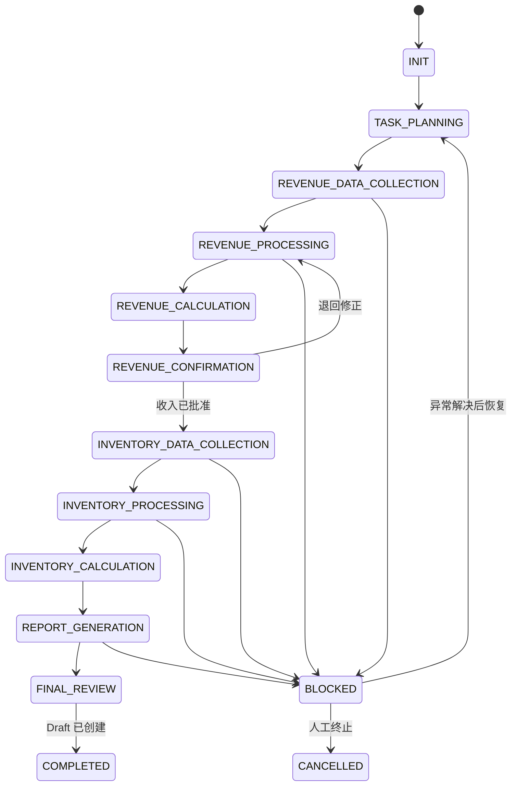

# Weekly Business Report Workflow 详细设计

> **历史版本提示**
>
> 本文件是Phase 1设计草案，仅用于追溯，不再作为当前Workflow、字段合同、
> Pipeline依赖、Result Contract或Implementation状态的权威来源。当前实现基线请依次读取：
>
> 1. `phase1_5/assets/readiness/status_index.yaml`
> 2. `phase1_5/assets/readiness/implementation_baseline.yaml`
> 3. `phase1_5/workflows/weekly_business_report/WORKFLOW_v2.md`
>
> 当前代码实现尚未开始，必须等待Owner对冻结Baseline ID和版本的明确批准。
> 下文中的Draft状态、步骤划分和输出描述不得直接转成代码需求。

## 1. Workflow 身份

| 项目 | 定义 |
|---|---|
| Workflow_ID | `WF_WEEKLY_BUSINESS_REPORT` |
| 版本 | `0.1.0-draft` |
| 状态 | Design Draft |
| 目标 | 处理收入与库存数据，计算并保存指标，生成收入 Excel 与 Outlook Draft |
| 触发方式 | 周四/周五定时入口 + 手动补跑入口 |
| 自动发送邮件 | 禁止 |
| 业务 Owner | `TBD` |
| 运行 Owner | `TBD` |

## 2. 请求契约

最小请求字段：

- `workflow_id`
- `reporting_period`：可显式传入；未传时按已批准周期配置计算。
- `as_of_date`
- `output_types`：Revenue Excel、Metrics、Outlook Draft。
- `run_mode`：Scheduled / Manual / Backfill。
- `reason`：补跑或回溯时必填。

如果周期配置仍为 Draft，系统不得自行解释“本周”，必须要求人工确认。

## 3. 运行状态

库存阶段在实际调度中可以与“收入等待确认”部分并行准备，但 MVP 设计以清晰依赖为先；并行方式在实现评审时再确定。

## 4. 详细步骤

### W01 — 初始化任务

- Skill：Analytics Core
- 输入：触发信息、周期配置、Workflow 版本。
- 动作：生成 `Run_ID`，解析并锁定报告周期。
- 输出：Task Definition。
- 阻断：周期规则未批准或日期冲突。

### W02 — 获取收入邮件

- 计划时间：每周四 17:30。
- Skill：Data Engine。
- 输入：Revenue Outlook Source Config。
- 动作：按发件人、主题、时间窗、附件规则定位候选邮件。
- 输出：选中邮件引用、附件引用、获取摘要。
- 阻断：无唯一匹配、附件缺失、文件格式不支持。
- 禁止：在多个候选邮件中按内容猜选。

### W03 — 标准化收入数据

- Skill：Data Engine。
- 输入：收入附件、Revenue Field Mapping、业务维度和基础规则。
- 动作：字段映射、类型转换、必填检查、重复检查、日期和金额格式标准化。
- 输出：标准化收入数据引用、质量摘要。
- 阻断：未知必需字段、标准字段缺失、关键类型无法转换。

### W04 — 计算收入指标

- Skill：Calculation Engine。
- 输入：标准化收入数据、Revenue Metric Manifest、规则和验证规则。
- 动作：只执行 Active 指标版本，形成指标值和血缘。
- 输出：Revenue Metrics Draft。
- 阻断：指标定义未批准、核心对账失败、公式输入缺失。

### W05 — 生成收入 Excel

- Skill：Output Engine。
- 输入：已验证 Revenue Metrics、标准化结果、Revenue Excel Template。
- 动作：填充文件并按配置命名。
- 输出：收入 Excel Draft。
- 阻断：模板字段缺失、命名规则无效、输出数字与已验证指标不一致。

### W06 — 收入人工确认

- Skill：Analytics Core 管理确认状态。
- 确认内容：报告周期、收入总额、关键维度、异常说明、Excel 文件。
- 结果：Approve / Reject / Request Change。
- 规则：只有批准版本可以进入最终周报；修改后形成新版本，不覆盖旧版本。

### W07 — 获取库存数据

- 计划时间：每周五 10:30。
- Skill：Data Engine。
- 输入：Inventory Platform Source Config。
- 动作：按已批准方式获取或接收导出文件，检查更新时间和数据周期。
- 输出：库存输入引用、获取摘要。
- 阻断：访问失败、导出周期错误、文件不完整。

### W08 — 标准化库存数据

- Skill：Data Engine。
- 输入：库存导出、Inventory Field Mapping、业务维度和基础规则。
- 动作：字段映射、类型转换、必填/重复/范围检查。
- 输出：标准化库存数据引用、质量摘要。
- 阻断：未知必需字段、粒度冲突、关键维度缺失。

### W09 — 计算库存指标

- Skill：Calculation Engine。
- 输入：标准化库存数据、Inventory Metric Manifest、验证规则。
- 输出：Validated Inventory Metrics 和血缘。
- 阻断：核心对账失败、指标口径未批准。

### W10 — 保存历史 Metrics

- Skill：Calculation Engine。
- 输入：Approved Revenue Metrics、Validated Inventory Metrics。
- 动作：以周期 × 业务维度 × Metric_ID × Metric_Version 写入最小充分记录。
- 输出：Metrics Store 写入摘要。
- 规则：同一结果键重跑时生成可审计的新版本或替代标记，不制造重复有效记录。

### W11 — 生成周报 Draft

- Skill：Output Engine。
- 前置：收入已批准、库存已验证、所需历史指标已读取。
- 输入：当前 Metrics、Historical Metrics、Outlook Template。
- 输出：Outlook Draft。
- 检查：主题、周期、数字、单位、比较基期、附件、收件人占位和免责声明。
- 禁止：自动发送。

### W12 — 完成与学习检查

- Skill：Analytics Core。
- 输出：运行摘要、异常清单、版本清单、输出引用。
- 学习检查：识别新字段、新规则、新指标或新案例，只创建变更候选，不直接发布。

## 5. 阻断与警告

| 条件 | 类型 | 是否继续 |
|---|---|---|
| 找不到唯一收入邮件 | Blocking | 否 |
| 必需字段无法映射 | Blocking | 否 |
| 非必需新字段 | Warning + 待确认 | 可以，由配置决定 |
| 收入核心对账不一致 | Blocking | 否 |
| 历史对比周期缺失 | Warning | 可生成，但必须标注 |
| 库存更新时间早于允许阈值 | Blocking/Warning | 由配置决定 |
| Draft 收件人未配置 | Warning | 可创建无收件人 Draft |
| 模板必填占位未填充 | Blocking | 否 |

## 6. 血缘和版本

每次输出必须记录：

- Workflow、Data Source、Mapping、Rule、Metric、Template 版本。
- 输入来源引用与数据时间。
- 计算时间、确认状态和确认人。
- 当前指标值使用的报告周期及比较周期。

## 7. 补跑策略

- 收入邮件迟到：从 W02 补跑。
- Mapping 修复：从受影响的 W03 或 W08 补跑。
- 指标定义修复：从 W04 或 W09 补跑。
- 模板修复：只重跑 W05 或 W11。
- 历史指标补齐：重跑 W11，不重新获取原始数据。
- 所有补跑继续使用原 `Run_ID`，增加 Attempt 和原因。

## 8. MVP 验收

- 三个阶段能由同一 Run 串联。
- 每个阻断条件可解释并关联异常。
- 收入结果未经批准时无法完成最终 Draft。
- 指标结果可追溯到输入和各类版本。
- 历史 Metrics 写入满足最小充分原则。
- Outlook 中只出现 Draft，无自动发送行为。
