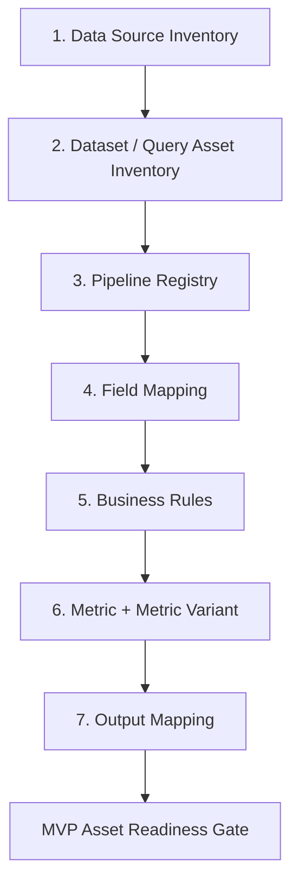

# Business Asset Initialization — Execution Plan

> 架构基线：Weekly Business Report Workflow v2
> 资产模板版本：v2.1（轻量字段更新）
> 当前阶段：业务资产初始化，不进入代码实现
> 录入方式：一次只推进一个资产类别；确认后才进入下一类

## 1. 初始化执行顺序

Business Dimension 不再作为孤立步骤：在 Dataset Inventory 中登记 Dataset 支持的维度，在 Field Mapping 阶段确认原始字段到标准维度，在 Business Context 中确认适用范围。

## 2. 每个资产类别的固定流程

1. 说明该资产在 Agent 中的作用。
2. 只列出当前类别需要提供的信息。
3. 提供填写模板。
4. 提供明确标注的 Example。
5. 说明确认后的文件位置、ID 和版本。
6. 等待用户确认，不进入下一类别。

所有 Example 均不得转为真实配置。

## 3. 阶段一：Data Source Inventory

### 目标

识别当前及已确认近期 Workflow 实际需要的数据来源，不将 Source 等同于
Domain、Dataset 或 Pipeline。本阶段不建立全公司数据平台目录。

### 按需激活原则

- Active Data Source Inventory只登记当前Workflow实际使用，或已确认支持近期
  Workflow的数据入口。
- 仅因公司存在、但当前没有明确Workflow需求的平台进入Future Data Source
  Backlog，不登记为Active Source。
- Future Candidate只记录`source_name`、`potential_business_use`、`status`和
  `notes`。
- Future Candidate不进入Dataset Inventory、Pipeline Registry或Metric Library。
- Dataset及后续资产只允许从Active Data Source展开。

### 当前需要盘点

- Outlook 邮箱或共享邮箱。
- 公司数据平台。
- 其他实际数据系统或文件来源。

### 当前不盘点

- 字段 Mapping。
- 查询结果的业务粒度。
- 指标公式。

### 产物

- `templates/data_source_inventory.template.yaml`
- `templates/future_data_source_backlog.template.yaml`
- 工作簿“Data Source Inventory”

## 4. 阶段二：Dataset / Query Asset Inventory

### 目标

将每个附件、导出或查询结果登记为独立 Dataset，并记录其 Query Asset。

### 关键要求

- 同一平台的不同查询结果分别登记。
- 两个相似邮件附件的业务角色分别确认。
- 粒度、日期含义或用途不明确时保持 `TBD`。

### 产物

- `templates/dataset_inventory.template.yaml`
- 工作簿“Dataset Inventory”“Query Asset Inventory”

## 5. 阶段三：Pipeline Registry

### 目标

将 Dataset 通过显式依赖绑定到最小执行单元 Pipeline。

### 关键要求

- 每个 Dataset Dependency 有明确 Role。
- 多 Dataset Pipeline 明确 Join/Relationship Rule 引用。
- Required/Optional、失败影响范围和补跑起点显式配置。
- 禁止按字段名、Dataset 名称或历史结果自动建立关系。

### 产物

- `templates/pipeline_registry.template.yaml`
- 工作簿“Pipeline Registry”“Pipeline-Dataset依赖”

## 6. 后续阶段

### Field Mapping

每个 Dataset 独立 Mapping Profile。未知字段不得自动映射。

### Business Rules

按 Pipeline、Dataset 和 Business Context 定义 Rule Set 及执行顺序。

### Metrics

先定义稳定 Metric，再定义显式绑定 Dataset、Context、Rule 和 Formula 的 Metric Variant。

### Output Mapping

分别定义 Weekly Revenue Section、Weekly Inventory Section、Customer Revenue Excel 和 Outlook Draft 映射。Output Assembly 不包含计算。

## 7. P0 总体验收标准

### 7.1 Data Source Inventory

- 所有已知 MVP Source 有唯一 Source_ID。
- Source 类型、访问方式、更新时间和 Owner 已登记。
- Source 不包含字段、业务规则或指标公式。
- 不保存密码、Token 或认证秘密。
- 未知内容保持 `TBD`。

### 7.2 Dataset / Query Asset Inventory

- 每个实际查询结果、附件角色或导出有唯一 Dataset_ID。
- 每个 Dataset 显式引用 Source_ID。
- Dataset引用的Source必须为Active Data Source，不能引用Future Backlog。
- Dataset 粒度、时间语义、用途和 Owner 已确认或明确 `TBD`。
- 同一 Source 的不同 Query Result 分别登记。
- Query Asset 与输出 Dataset 的关系显式。
- 不因 Schema 相似而自动共享 Mapping。

### 7.3 Pipeline Registry

- 每个 MVP Pipeline 有唯一 Pipeline_ID。
- 每个 Dataset–Pipeline 依赖显式登记。
- Pipeline使用的Dataset必须可追溯到Active Data Source。
- Pipeline 是最小执行、验证、异常和补跑单元。
- Required/Optional 及失败影响范围明确。
- 多 Dataset 关系引用已批准的 Join/Relationship Rule，或保持 `TBD`。
- 不存在自动推断依赖。

### 7.4 Field Mapping

- 每个 Dataset 有独立 Mapping Profile。
- 必需标准字段、类型和未知字段策略明确。
- 未知字段不得自动匹配。
- Mapping 有 Owner、版本和证据来源。

### 7.5 Business Rules

- Rule Set 显式绑定 Pipeline、Dataset 和 Business Context。
- 执行顺序、输入、输出、阻断条件和版本明确。
- 未确认业务规则保持 `TBD`。

### 7.6 Metrics

- Metric 与 Metric Variant 分开登记。
- 每个 Variant 显式引用 Dataset、Context、Rule 和 Formula。
- Pipeline 只引用唯一 Active Metric_Variant_ID。
- 验证规则和 Owner 明确。

### 7.7 Output Mapping

- 每个输出位置显式引用 Validated Result Contract。
- Output Mapping 不包含公式或业务判断。
- Weekly Workflow 不依赖 Customer Revenue Excel 文件。
- Workflow 间只通过 Metrics Store 或 Metric Result Contract 共享结果。
- Outlook `auto_send=false`。

## 8. MVP Asset Readiness Gate

进入技术实现前，必须满足：

- Required Pipeline 的所有 P0 资产达到 `Approved`，或存在业务 Owner 批准的临时版本。
- 依赖图不存在循环或未解释的自动关系。
- 每个结果可追溯至 Source、Dataset、Pipeline、Context、Rule 和 Metric Variant。
- Customer Revenue Detail 与 Weekly Workflow 无文件级依赖。
- Output Assembly 的所有输入均为已验证结果。
- 所有 `TBD` 已被识别为阻断项或批准的非阻断项。
