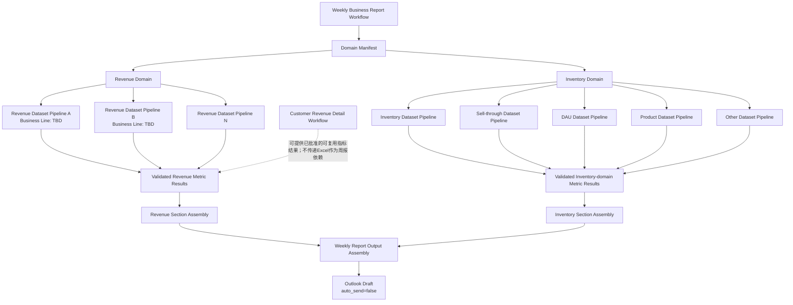
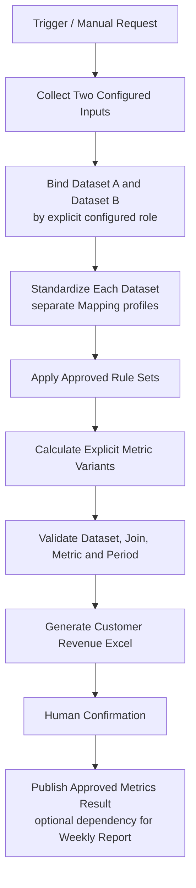
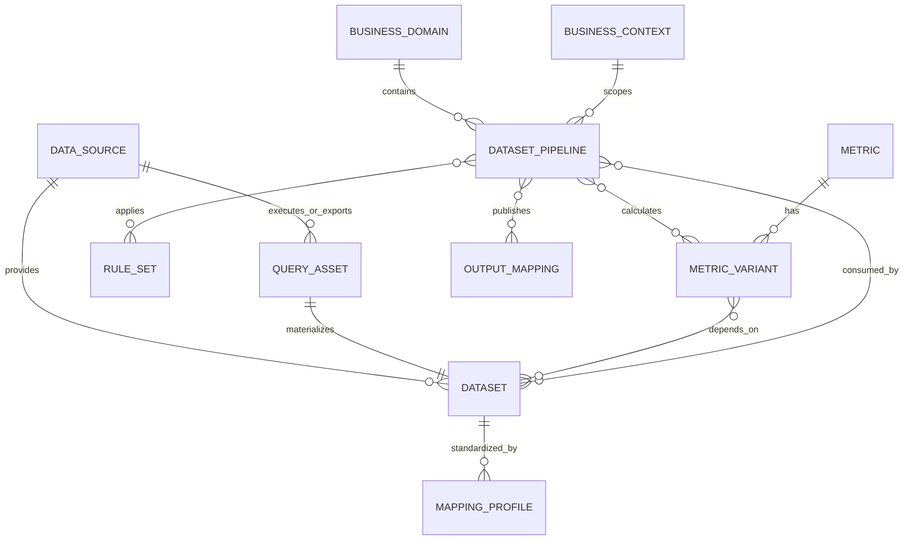
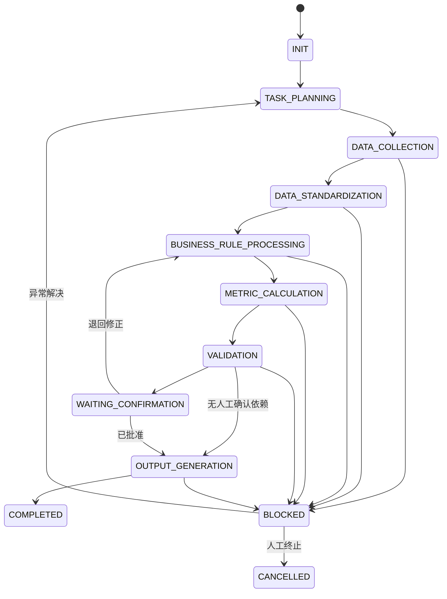

# Weekly Business Report Workflow Architecture Optimization v2

> 状态：Architecture Approved — Migrated to `WORKFLOW_v2.md`
> 范围：只优化 Weekly Business Report Workflow 内部业务拆分
> 不变：4 个通用 Skill、Knowledge Pack 原则、配置驱动、异常阻断、Outlook `auto_send=false`
> 当前不做：代码实现、真实字段 Mapping、真实业务规则、真实指标公式

## 0. 核心结论

Weekly Business Report 不再由一个统一的 `Revenue Process` 和一个统一的 `Inventory Process` 构成。建议改为：

1. **Business Domain** 管理业务语义边界，如 Revenue、Inventory。
2. **Data Source** 表示可访问的数据来源或系统，不等于 Dataset。
3. **Dataset / Query Asset** 表示一个有明确粒度、字段结构、刷新时间和用途的数据资产。
4. **Dataset Pipeline** 绑定一个或多个 Dataset、Mapping、Rule Set、Metric Variant 和 Output Mapping。
5. **Business Rule** 在明确 Dataset 和 Business Context 下执行。
6. **Metric Engine** 通过显式 `Metric Variant` 选择计算逻辑，不根据名称自动判断。
7. **Output Assembly** 只组装已验证结果，不重新计算或解释指标。

Customer Revenue Detail 建议成为独立 Workflow，而不是 Weekly Revenue Section 的附属输出。

---

## 1. 更新后的 Weekly Business Report Workflow 架构图



### 1.1 单个 Pipeline 的通用执行链


### 1.2 设计含义

- Domain 是业务分类，不是处理程序。
- Source 是来源，不是业务模块。
- Dataset 是可治理的数据资产，不等于一个平台。
- Pipeline 是执行单元，可以一对一处理 Dataset，也可以在明确依赖下组合多个 Dataset。
- Workflow 编排 Pipeline 依赖和输出组装，不承载字段或公式细节。

---

## 2. Revenue Domain 重新设计

### 2.1 Revenue Domain 的职责

Revenue Domain 保存收入相关的共享业务语义：

- 收入业务对象与业务线清单。
- 跨业务线可共用的标准维度定义。
- Revenue Dataset Pipeline Registry。
- 可跨 Pipeline 比较或汇总的 Metric 语义。
- Weekly Report Revenue Section 的输出组装规则。

Revenue Domain 不定义一个统一收入 Schema，也不强制所有业务线使用相同 Mapping、Rule 或 Formula。

### 2.2 Revenue Dataset Pipeline

每条业务线或一组具有同一数据契约的收入数据，建立独立 Pipeline：

| 配置部分 | 内容 |
|---|---|
| Pipeline Identity | Pipeline_ID、业务线、Owner、版本、状态 |
| Data Source Dependency | 一个或多个 Source_ID |
| Dataset Dependency | 一个或多个 Dataset_ID |
| Mapping Profile | Dataset 对应的 Mapping_Profile_ID |
| Business Context | Business_Context_ID、适用业务线、产品、周期和维度 |
| Rule Sets | 有顺序和版本的 Rule_Set_ID |
| Metric Variants | 明确指定 Metric_Variant_ID |
| Validation | 数据、规则和指标验证清单 |
| Output Mapping | 进入周报收入模块的 Section、位置、展示规则 |

### 2.3 多 Pipeline 收入汇总

多个收入 Pipeline 先分别完成标准化、规则处理、指标计算和验证，再进入 Revenue Section Assembly。

汇总必须满足：

- 指标语义兼容。
- 单位与币种兼容。
- 报告周期一致。
- 聚合维度兼容。
- 指标版本允许比较或汇总。
- 不存在重复业务范围。

任一条件未确认时，不允许把多个 Pipeline 的结果直接相加。应保留分业务线展示或创建 Blocking Exception。

### 2.4 Revenue Domain 建议资产结构

```text
knowledge_packs/revenue/
├── INDEX.md
├── business_definition.md
├── business_lines.yaml
├── dimensions/
├── pipeline_registry.yaml
├── contexts/
├── rules/
└── output_mappings/

data_assets/
├── sources/
├── datasets/
├── mappings/
└── pipelines/revenue/
```

该结构是设计目标，实际文件在提案确认后创建。

---

## 3. Customer Revenue Detail Workflow 设计

### 3.1 架构定位

建议建立独立 Workflow：

- `Workflow_ID`：`WF_CUSTOMER_REVENUE_DETAIL`
- 业务目标：为特定业务线生成分客户收入 Excel。
- 调度和人工确认：独立于 Weekly Business Report。
- 复用 Skill：Data Engine、Calculation Engine、Output Engine，以及 Analytics Core 的状态管理。
- 与周报关系：可以发布经批准的指标结果供 Weekly Revenue Section 引用；Excel 文件本身不作为周报逻辑的一部分。

选择独立 Workflow 的原因：

- 业务目标不同：客户明细 Excel 与周报收入摘要不同。
- 范围不同：只覆盖一个业务线。
- 输入契约不同：固定依赖 Outlook 中两个邮件附件。
- 确认和补跑边界不同。
- 模板和输出版本独立。

### 3.2 内部数据资产

目前只能确认“存在两个格式相似、主要日期不同的收入邮件附件”。它们的真实业务角色仍为 `TBD`。

建议先定义占位资产：

| 资产 | 暂定标识 | 当前未确认内容 |
|---|---|---|
| Outlook 来源 | `SRC_CUSTOMER_REVENUE_OUTLOOK` | 邮箱、发件人、主题规则 |
| 邮件/附件输入 A | `DS_CUSTOMER_REVENUE_A` | 业务角色、日期含义、粒度 |
| 邮件/附件输入 B | `DS_CUSTOMER_REVENUE_B` | 业务角色、日期含义、粒度 |
| Pipeline | `PIPE_CUSTOMER_REVENUE_DETAIL` | 两个 Dataset 如何组合 |
| Business Context | `CTX_CUSTOMER_REVENUE_TBD` | 业务线、客户范围、周期 |
| Metric Variants | `TBD` | 指标及公式 |
| Excel Output Mapping | `OM_CUSTOMER_REVENUE_EXCEL` | 模板字段和单元格映射 |

这些名称只是资产占位，不代表真实规则。

### 3.3 Workflow 流程



### 3.4 关键控制

- 两封邮件不能只按“日期更近”自动判断角色。
- 每个附件需绑定明确 Dataset Role；未确认时为 `TBD`。
- 如果两个附件字段结构未来发生分化，可以拥有两个 Mapping Profile。
- 两个 Dataset 的 Join Key、时间关系和优先级未确认前不得设计。
- Excel 模板只消费已验证结果。
- Outlook 数据获取规则与 Field Mapping 分开配置。

---

## 4. Inventory Domain 重新设计

### 4.1 Source 与 Dataset 解耦

Inventory Domain 可能有两个公司数据平台，但主要平台可产生约 4–5 个不同查询结果。设计上：

- 平台登记为 Data Source。
- 每个查询结果登记为独立 Dataset / Query Asset。
- 每个 Dataset 有自己的粒度、Schema、刷新时间、Mapping 和用途。
- Pipeline 依赖 Dataset，而不是笼统依赖“平台”。

### 4.2 建议的占位 Pipeline

以下均为资产类型示例，真实标识和逻辑保持 `TBD`：

| Pipeline 类型 | Dataset 类型 | 主要产出 |
|---|---|---|
| Inventory Dataset Pipeline | Inventory Query Result | Inventory Metric Variants |
| Sell-through Dataset Pipeline | Sell-through Query Result | Sell-through Metric Variants |
| DAU Dataset Pipeline | DAU Query Result | DAU Metric Variants |
| Product Dataset Pipeline | Product Query Result | Product Dimension / Attribute Results |
| Other Business Dataset Pipeline | TBD | TBD |

### 4.3 Dataset 组合

不是所有 Pipeline 都必须只消费一个 Dataset：

- 单 Dataset Metric：直接基于一个标准化 Dataset。
- Lookup Enrichment：主 Dataset 通过已批准 Key 关联 Product Dataset。
- Multi-Dataset Metric：明确依赖两个或更多 Dataset，并配置 Join、时间对齐和重复处理规则。

多 Dataset 计算必须先确认：

- 每个 Dataset 的粒度。
- Join Key 和基数关系。
- 时间字段及对齐方式。
- 重复记录处理。
- 缺失关联处理。
- 哪个 Dataset 控制业务范围。

任何一项为 `TBD` 时，不建立真实 Join 或指标公式。

### 4.4 同名指标的不同逻辑

“库存”或“售卖率”不能只通过 Metric_Name 选择公式。不同产品、Dataset 或业务维度应绑定不同 Metric Variant。

Pipeline 必须显式引用 Variant：

```text
Pipeline
  → Business_Context_ID
  → Dataset_Dependency
  → Metric_Variant_ID
```

Calculation Engine 不根据产品名称、字段相似度或指标名称自动选择 Variant。

---

## 5. Dataset Pipeline 模型

### 5.1 Pipeline 定义

Pipeline 是一个配置化执行契约，不是 Skill。建议字段：

| 字段组 | 字段 |
|---|---|
| Identity | Pipeline_ID、Name、Domain、Business_Line、Owner、Version、Status |
| Trigger | Trigger_Mode、Schedule_Reference、Manual_Allowed |
| Inputs | Source_ID、Dataset_ID、Query_Asset_ID、Required/Optional |
| Context | Business_Context_ID、Period_Context、Dimension_Scope |
| Standardization | Mapping_Profile_ID、Data_Type_Profile、Unknown_Field_Policy |
| Rules | Ordered Rule_Set_ID、Rule Version |
| Metrics | Explicit Metric_Variant_ID 列表 |
| Validation | Dataset、Rule、Metric 和 Cross-Dataset Validation_ID |
| Outputs | Output_Mapping_ID、发布的 Result Contract |
| Recovery | Retry_From_Stage、Dependency Policy |

### 5.2 Dataset Definition

每个 Dataset 至少包含：

- `Dataset_ID`
- `Dataset_Name`
- `Business_Domain`
- `Source_ID`
- `Query_Asset_ID` 或文件/附件选择规则引用
- `Business_Purpose`
- `Record_Grain`
- `Primary/Business_Key`
- `Snapshot_or_Period_Type`
- `Business_Date_Field`
- `Expected_Update_Time`
- `Schema_Profile_ID`
- `Mapping_Profile_ID`
- `Supported_Business_Context_ID`
- `Owner`
- `Version`
- `Status`

Dataset Definition 只描述数据资产，不保存指标公式。

### 5.3 Pipeline 输出契约

Pipeline 不直接返回任意中间表。建议输出：

- 标准化 Dataset 引用。
- 数据质量结果。
- 已应用的 Rule Set 版本。
- Validated Metric Results。
- Calculation Lineage。
- Output-ready Result Contract。
- Exception 引用。

---

## 6. Data Source 与 Dataset 关系设计

### 6.1 关系模型



### 6.2 基数原则

- 一个 Data Source 可以提供多个 Dataset。
- 一个 Dataset 默认有一个控制 Source，但可以记录补充来源；多来源融合应通过 Pipeline 表达。
- 一个 Query Asset 产生一个明确 Dataset 版本；查询逻辑变化触发 Query/Dataset 版本评审。
- 一个 Dataset 可以服务多个 Pipeline。
- 一个 Pipeline 可以消费多个 Dataset。
- 同一 Mapping Profile 不默认跨 Dataset 复用，即使字段名相似。
- 同一 Data Source 的不同查询结果不共享粒度和 Schema 假设。

### 6.3 Query Asset

Query Asset 是 Dataset 的获取定义，建议记录：

- Query_Asset_ID
- Source_ID
- 查询或导出名称
- 参数和过滤器说明
- 输出 Dataset_ID
- 查询结果粒度
- 预期刷新时间
- Owner
- Version
- 证据来源

本阶段可以保存查询说明或平台操作步骤，但不要求编写查询代码。

---

## 7. Metric Engine 调整方案

### 7.1 两层指标模型

建议将指标拆成：

#### Metric

表示稳定的业务概念：

- `Metric_ID`
- `Metric_Name`
- `Business_Domain`
- `Business_Definition`
- `Unit`
- `Owner`
- `Supported_Period`
- `Metric_Version`

#### Metric Variant / Calculation Specification

表示在特定 Dataset 和业务上下文中的计算实现：

- `Metric_Variant_ID`
- `Metric_ID`
- `Business_Context_ID`
- `Dataset_Dependency`
- `Dataset_Version_Constraint`
- `Rule_Set_Dependency`
- `Formula`
- `Calculation_Method`
- `Base_Grain`
- `Aggregation_Level`
- `Supported_Dimensions`
- `Comparison_Type`
- `Missing_Value_Policy`
- `Validation_Rule`
- `Variant_Version`
- `Effective_From/To`
- `Status`

这样可以保留“库存”作为一个稳定业务概念，同时为不同产品或 Dataset 定义多个经过批准的计算变体。

### 7.2 Business Context

`Business_Context_ID` 建议包含：

- Business Domain。
- 业务线。
- 产品或产品类别。
- 客户/资源范围。
- Dataset 组合。
- 适用周期。
- 允许的聚合维度。
- 包含/排除范围引用。

Context 必须显式配置。Calculation Engine 只执行 Pipeline 指定的 `Metric_Variant_ID`，不做自然语言匹配。

### 7.3 Variant 选择规则

运行时使用：

```text
Pipeline_ID
  + Business_Context_ID
  + Dataset_ID / Version
  + Metric_Variant_ID / Version
```

禁止使用：

- 仅凭 Metric_Name 选择公式。
- 仅凭字段名相似度选择 Dataset。
- 仅凭 Product Name 自动套用业务规则。
- 未配置 Variant 时退回通用公式。

找不到唯一 Active Variant 时创建 Blocking Exception。

### 7.4 Lineage 调整

每个结果增加：

- Domain_ID
- Pipeline_ID / Version
- Source_ID / Version
- Query_Asset_ID / Version
- Dataset_ID / Version
- Mapping_Profile_ID / Version
- Business_Context_ID / Version
- Rule_Set_ID / Version
- Metric_ID / Version
- Metric_Variant_ID / Version
- Output_Mapping_ID / Version

### 7.5 示例（Example，不代表真实逻辑）

```text
Example Metric:
  Metric_ID: METRIC_INVENTORY_RATE

Example Variant A:
  Business_Context: Example Product Category A
  Dataset: Example Dataset A
  Formula: Example Formula A

Example Variant B:
  Business_Context: Example Product Category B
  Dataset: Example Dataset B
  Formula: Example Formula B
```

该示例仅说明结构。真实 Dataset、Context 和公式均保持 `TBD`。

---

## 8. Workflow 状态调整

### 8.1 Workflow 级状态



### 8.2 Pipeline 级状态

Workflow 的每个通用阶段下，维护各 Pipeline 的状态矩阵：

| Pipeline_ID | Collection | Standardization | Rules | Metrics | Validation | Output |
|---|---|---|---|---|---|---|
| Pipeline A | Status | Status | Status | Status | Status | Status |
| Pipeline B | Status | Status | Status | Status | Status | Status |

这样可以：

- 并行运行无依赖 Pipeline。
- 只补跑失败 Pipeline。
- 在输出组装前检查所有 Required Pipeline。
- 对 Optional Pipeline 缺失采用已批准的降级规则。

Optional/Required 属性必须配置，不能由 Agent 临时决定。

---

## 9. Business Asset Initialization 新顺序

不再从“Revenue Outlook”作为孤立资产开始。先建立 MVP 数据资产目录，再按实际执行依赖逐步深化。

### P0-1：Data Source Inventory

目标：登记所有 MVP 相关来源，不把 Source 等同于 Domain。

先收集：

- Source_ID、类型、访问方式、Owner、更新频率。
- Outlook 邮箱、公司平台及其他实际来源。
- 不收集字段公式。

完成标准：所有已知 MVP Dataset 都能指向一个 Source，未知来源明确为 `TBD`。

### P0-2：Dataset / Query Asset Inventory

目标：识别每个实际输入或查询结果。

先收集：

- Dataset 名称、来源、查询/附件角色、粒度、刷新时间、用途。
- Query Asset 与 Dataset 的一对一产出关系。
- Pipeline 候选绑定。

完成标准：不再使用“平台数据”或“收入附件”作为笼统 Dataset 名称。

### P0-3：Field Mapping

按 Dataset 分别建立 Mapping Profile：

- Source Field → Standard Field。
- 类型、必需性、转换规则。
- 未知字段策略。

即使两个 Dataset 字段相似，也不自动共享 Mapping。

### P0-4：Business Dimension

先定义 Domain 级标准维度，再配置：

- Dataset 是否支持该维度。
- 原始字段如何映射。
- 层级和允许聚合。
- Business Context 中适用范围。

### P0-5：Core Business Rules

按 `Dataset + Business Context` 盘点：

- Rule Set。
- 执行顺序。
- 输入输出。
- 阻断条件。
- 版本和生效范围。

### P0-6：Core Metrics

分两步：

1. 定义 Metric 业务概念。
2. 定义绑定 Dataset 和 Context 的 Metric Variant。

没有 Dataset Dependency 和 Context 的公式不能转为 Active。

### P0-7：Output Mapping

分别盘点：

- Weekly Revenue Section Mapping。
- Weekly Inventory Section Mapping。
- Customer Revenue Excel Mapping。
- Outlook Draft Mapping。

Output Mapping 只引用已验证结果，不包含隐藏计算。

### 渐进执行方式

每个资产类别仍遵守：

`说明作用 → 收集信息 → 填写模板 → Example → 确认存储 → 等待确认`

一个类别确认后才进入下一个类别。完成 Source 和 Dataset Inventory 后，优先选择一个 P0 Pipeline 做纵向验证，不要求立即补齐所有长尾 Pipeline 细节。

---

## 10. 对现有 WORKFLOW.md 需要修改的章节列表

提案确认后，修改 [现有 WORKFLOW.md](../phase1/workflows/weekly_business_report/WORKFLOW.md)：

| 当前章节 | 修改方式 |
|---|---|
| 1. Workflow 身份 | 将目标从“处理收入与库存数据”改为“编排 Domain 下的 Required Dataset Pipelines 并组装周报”；移除“收入 Excel”作为默认周报输出 |
| 2. 请求契约 | 增加 Domain Manifest、Pipeline Manifest、Dataset 版本、Required/Optional Pipeline 和 Output Mapping 引用 |
| 3. 运行状态 | 用通用阶段替换 Revenue/Inventory 专属状态；增加 Pipeline 状态矩阵 |
| 4. 详细步骤 | 删除 W02–W09 按 Revenue/Inventory 顺序硬拆的步骤，改为 Pipeline 通用执行链与 Domain Assembly |
| 4. Customer Revenue Excel | 从 Weekly Workflow 中移除，改为独立 `WF_CUSTOMER_REVENUE_DETAIL` |
| 5. 阻断与警告 | 增加 Dataset 唯一性、Query 版本、Join 粒度、Context、Metric Variant 和跨 Pipeline 汇总兼容性校验 |
| 6. 血缘和版本 | 增加 Query Asset、Dataset、Pipeline、Business Context、Metric Variant 和 Output Mapping 版本 |
| 7. 补跑策略 | 改为按 Pipeline_ID 和通用阶段补跑；避免整个 Domain 重跑 |
| 8. MVP 验收 | 改为验证多 Source、多 Dataset、多 Pipeline、同名指标多 Variant 和独立 Customer Revenue Workflow |

建议新增章节：

1. Domain Manifest。
2. Data Asset Dependency Graph。
3. Dataset Pipeline Registry。
4. Revenue / Inventory Section Assembly。
5. Customer Revenue Detail Workflow 依赖边界。
6. Required 与 Optional Pipeline 策略。
7. Metric Variant Resolution Rules。
8. Output Mapping Contract。

---

## 11. 对现有 Phase 1 资产的后续影响

提案确认后需要迁移，而不是直接废弃：

| 现有资产 | 调整 |
|---|---|
| Data Source Config | 保留，改为全局 Source Registry，不按 Revenue/Inventory 先后录入 |
| Revenue/Inventory Field Mapping 工作表 | 改为按 Dataset_ID 管理 Mapping Profile |
| Revenue/Inventory Dimensions | 保留 Domain 分类，增加 Dataset 支持范围和 Context |
| Business Rules | 增加 Dataset Dependency、Context 和 Rule Set 顺序 |
| Metric Library | 拆分 Metric 与 Metric Variant |
| Template Register | 扩展为 Output Mapping Registry |
| Asset Discovery Workbook | 增加 Dataset Inventory、Query Asset、Pipeline Registry、Business Context、Metric Variant 和 Output Mapping |

---

## 12. 待确认架构决策

在进入 Business Asset Initialization 前，只需确认以下架构级事项，不需要提供真实业务细节：

1. Customer Revenue Detail 是否正式作为独立 Workflow。
2. Weekly Report 是否只引用 Customer Revenue Detail 的已批准指标结果，而不依赖其 Excel 文件。
3. 是否接受 `Metric + Metric Variant` 两层模型。
4. 是否接受一个 Dataset 可服务多个 Pipeline、一个 Pipeline 可消费多个 Dataset。
5. 是否接受 Business Asset Initialization 从全局 Data Source Inventory 开始，而不是从 Revenue Outlook 单点开始。

真实 Source、Dataset、Context、Rule、Metric 和 Output 内容在后续逐项初始化，当前全部保持 `TBD`。
