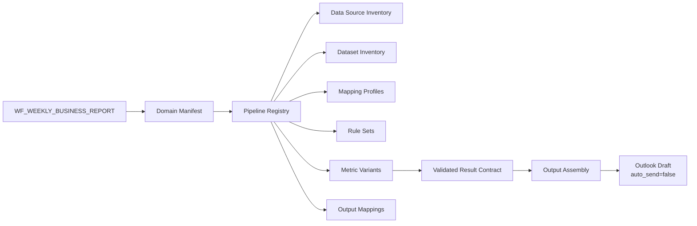
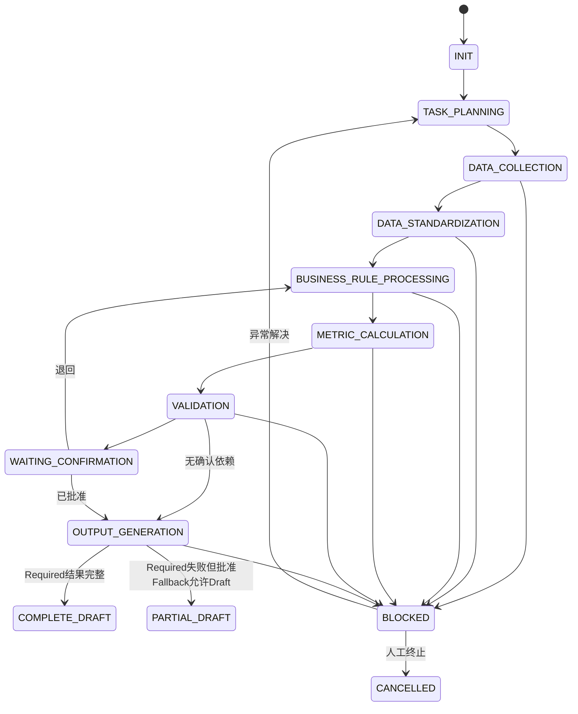

# Weekly Business Report Workflow v2

> Workflow_ID：`WF_WEEKLY_BUSINESS_REPORT`
>
> Version：`0.2.6-final-acceptance-closure`
>
> Status：Phase 1.5 assets complete / Result Contract Gate Passed / Inventory and Advertising Policy Gate Passed / Implementation Baseline 1.0.0 Frozen
>
> 旧版保留位置：`phase1/workflows/weekly_business_report/WORKFLOW.md`
>
> 当前阶段：等待Owner明确批准`IMPLEMENTATION_BASELINE_WF_WEEKLY_BUSINESS_REPORT_V1`版本`1.0.0`后才可开始代码实现

## 1. Workflow 目标

编排 Weekly Business Report 所需的 Business Domain、Dataset Pipeline 和已验证 Metric Result，生成周报各业务模块及 Outlook Draft。

Workflow 不假设一个统一 Revenue Process 或 Inventory Process，也不依赖 Customer Revenue Excel 文件。

最终输出：

- Weekly Report Revenue Section。
- Weekly Report Inventory Section。
- 其他已配置业务模块。
- Outlook Draft，且 `auto_send=false`。
- 运行、验证、异常和血缘摘要。

## 2. 架构边界

### Workflow 负责

- 解析报告周期。
- 读取 Domain、Pipeline 和 Output Manifest。
- 按显式依赖调度 Pipeline。
- 管理 Workflow 与 Pipeline 状态。
- 检查 Required Pipeline 是否全部通过。
- 将已验证 Metric Result 交给 Output Assembly。

### Workflow 不负责

- 推断 Source–Dataset 或 Dataset–Pipeline 关系。
- 执行字段 Mapping、业务规则或指标公式。
- 根据名称或字段相似性选择 Metric Variant。
- 使用其他 Workflow 的输出文件作为依赖。

### Output Assembly 负责

- 结果组装。
- Output Mapping。
- 模板映射。
- 格式和文件生成。

### Output Assembly 不负责

- 数据计算。
- 业务规则判断。
- 指标选择或公式执行。
- 修正上游验证失败。

## 3. 资产依赖

所有依赖使用 ID 和 Version 显式引用。未显式登记的关系不能在运行时建立。

## 4. Domain Manifest

MVP 至少包含：

| Domain_ID | 说明 | 状态 |
|---|---|---|
| `DOMAIN_REVENUE` | 周报收入模块所需 Pipeline 集合 | Dataset/Pipeline、Field Mapping、Revenue P0 Rules、Metrics 和 Output Mapping 已收口 |
| `DOMAIN_INVENTORY` | 周报库存及相关经营指标 Pipeline 集合 | Dataset/Pipeline、Field Mapping、Metrics 和 Output Mapping 已收口；产品路由使用已确认的本地策略 |

Domain 只定义业务语义和 Pipeline 集合，不定义统一 Source、Schema 或 Formula。
Advertising 与 User Analytics / Platform Operation 的支持型 Pipeline 已在正式
Pipeline Registry 中显式登记，不因周报展示位置改变其业务归属。

## 5. Workflow 状态

每个 Workflow Run 在任何 Pipeline 启动前必须生成并锁定唯一
`Workflow Run Context`。Context 统一提供：

- `run_type`：`scheduled`、`manual` 或 `backfill`；
- `workflow_reporting_date`：Scheduled Thursday 或 Manual/Backfill 明确指定的报告周期日期；
- `reporting_period_id` 及起止日期；
- `current_period_start_date` / `current_period_end_date`；
- `comparison_period_start_date` / `comparison_period_end_date`；
- `cutoff_date` 与 `timezone=Asia/Shanghai`；
- Revenue 的 `current_revenue_cutoff_date`：所选当前收入源内真实业务数据截止日。

`workflow_reporting_date`、邮件/附件 `source_report_date` 与
`source_business_data_cutoff_date` 是三个独立字段。Thursday 只定义
Scheduled cadence 和 Revenue `report_mode`；它不能覆盖邮件报告日期或真实收入
数据截止日。任何标注“收入截止”的表头或文件名只能使用
`current_revenue_cutoff_date`。Weekly Runtime Contract 的
`canonical_rule_context_bindings` 必须逐一覆盖全部 Active Business Rule 的
Context 字段、来源、派生和锁定规则，运行时禁止 Alias 猜测。

`target_business_line` 不属于单一 Workflow Run Context 标量；它必须由每个
Revenue Pipeline 的显式 Rule Context 独立绑定。Technical 固定绑定
`Technical`，CTV 固定绑定 `CTV`；Smart Speaker 与 Fast Version 只读取
Pipeline Registry 已登记的 `business_line` 身份，禁止从 Pipeline 名称、报表
显示名或相似文本推断。Technical Rolling Deck 与 CTV 当前邮件均按锁定的
`workflow_reporting_date` 精确匹配 `source_report_date`，而
`current_revenue_cutoff_date` 仅从独立的 `source_business_data_cutoff_date` 绑定。

Outlook、Apollo 与 NovaBI 的所有输入选择和查询参数只能读取该 Context。
实际执行时间只作为审计元数据；Scheduled、Manual、Backfill 均不得按当前日期、
文件名或执行时间重新推导业务日期。

每次运行还必须在采集前生成轻量 `Run Input Manifest`，逐项显式绑定
`workflow_run_id`、Dataset ID/Version、Query Asset（或显式
`not_applicable`）、`period_role`、本地输入引用和产品参数。Manifest 不允许
根据文件名、当前日期或列表顺序推断输入。

正式完成状态只有：

- `complete_draft`：全部 Required Pipeline 与输出校验通过；
- `partial_draft`：Required Pipeline 失败，但批准的 Fallback 允许使用其余已验证结果生成 Draft；Draft 正文开头必须显示受影响 Pipeline、范围、Fallback 和失败摘要，且不得标记为完整成功；
- `blocked`：Required 失败无批准 Fallback、Run Context/Manifest 无效，或无法生成可审阅 Draft。

## 6. Pipeline 是最小执行单元

每个 Pipeline 独立记录：

- `Pipeline_Run_ID`
- 当前通用阶段。
- 输入 Dataset 版本。
- Mapping、Rule、Metric Variant 和 Validation 版本。
- Required/Optional 属性。
- Attempt。
- 异常、Attempt 和整条 Pipeline 重跑记录。

### Pipeline 状态矩阵

正式 Pipeline 清单、Required/Optional、依赖、失败范围及补跑规则以
`phase1_5/assets/pipelines/pipeline_registry.yaml`为唯一配置来源，本文不复制
运行配置。

| Registry状态 | Pipeline数量 | Field Mapping | Business Rules | Metric Variants | Output Mapping |
|---|---:|---|---|---|---|
| Completed / Readiness Gate Pass | 12 | Passed | Revenue P0 Passed | Passed | Passed |

### 补跑规则

- 首个 MVP 的 12 个 Pipeline 全部按 Registry 登记顺序 `sequential` 执行。
- 不存在并行执行资格；不实现并行 Pipeline 调度。
- 任一 Pipeline 失败后的恢复模式统一为 `rerun_pipeline_from_start`。
- 重跑从该 Pipeline 的首个适用执行阶段开始，并必须保持幂等；Attempt 递增。
- 不实现阶段级 Checkpoint，也不支持 `resume_from_failed_stage`。
- 默认不重跑其他已成功 Pipeline；仅当显式依赖结果失效时，后续按 Registry 顺序重跑受影响 Pipeline。
- Output Assembly 不是 Pipeline 阶段续跑；若上游 Validated Result Contract 仍有效，可单独重新组装固定输出。

以上运行语义以 `pipeline_registry.yaml.constraints.mvp_pipeline_execution` 为唯一配置来源。

## 7. 通用 Pipeline 执行阶段

### DATA_COLLECTION

- 根据 Workflow Run Context 与 Run Input Manifest 中显式绑定的 Source_ID、Dataset_ID、Version、Query_Asset_ID、period_role、本地输入引用和产品参数获取输入。
- 验证来源、数据周期、刷新时间和唯一输入。
- 禁止按实际执行日期、当前日期或文件名推断业务日期、Dataset 或产品。
- 不解释字段业务含义。

### DATA_STANDARDIZATION

- 使用 Dataset 专属 Mapping_Profile_ID。
- 完成类型、标准字段、必需字段和 Schema 校验。
- 未知字段按配置创建异常；禁止自动匹配。

### BUSINESS_RULE_PROCESSING

- 按 Pipeline 中显式排序的 Rule_Set_ID 执行。
- Rule 未批准、适用 Context 不明确或版本冲突时阻断。

### METRIC_CALCULATION

- 只执行 Pipeline 显式引用的 Metric_Variant_ID。
- 不按 Metric_Name、产品名或历史结果自动选择公式。
- 下游计算只允许消费 `value_status=valid_value`；`missing` 与 `not_applicable` 只能按字段合同明确处理，`pending_confirmation` 禁止进入计算。

### VALIDATION

- 执行 Dataset、Join、Rule、Metric 和跨 Pipeline 验证。
- 生成 Validated Result Contract。

### OUTPUT_GENERATION

- 只消费 Validated Result Contract 中 `value_status=valid_value` 的明确字段。
- `missing` 与 `not_applicable` 仅按字段合同明确省略或展示；`pending_confirmation` 禁止进入周报正文。
- 根据 Output_Mapping_ID 生成周报模块和 Outlook Draft。
- 不重新计算指标。

## 8. Revenue Domain

Revenue Domain 包含多个 Revenue Dataset Pipeline。不同业务线可以拥有不同：

- Source。
- Dataset / Query Asset。
- Mapping Profile。
- Business Context。
- Rule Set。
- Metric Variant。

各 Pipeline 完成验证后，Revenue Section Assembly 才能组装结果。跨 Pipeline 汇总必须通过单位、周期、范围、维度和 Metric 兼容性验证。

## 9. Inventory Domain

Inventory Domain 按 Dataset / Query Asset 管理 Pipeline，不按平台拆分。一个公司平台可以提供：

- Inventory Dataset。
- Sell-through Dataset。
- DAU Dataset。
- Product Dataset。
- 其他已正式登记且具备显式版本与 Run Input Manifest 绑定的 Dataset。

以上只是 Dataset 类型占位，不代表已确认的真实资产。

## 10. Customer Revenue Detail 边界

`WF_CUSTOMER_REVENUE_DETAIL` 是独立 Workflow：

- 可复用已登记的 Outlook Source、Rolling Deck Dataset 与共享 Mapping Profile；复用输入资产不建立 Workflow 依赖。
- Customer 自有 Pipeline、Run Context、Business Rule、Metric Variant、Result Contract 与 Output Mapping。
- 生成 Customer Revenue Excel。
- 与 Weekly Workflow 不产生文件级依赖。
- 当前 V1 不发布供 Weekly 消费的 Metrics Store 或跨 Workflow Result Contract。
- Weekly Workflow 不检查 Customer Revenue Excel 是否已生成。

## 11. Required 与 Optional Pipeline

- Required：失败时阻断相关周报模块或整个输出，具体范围显式配置。
- Optional：缺失时是否允许输出、如何标注必须预先配置。
- Agent 不得临时将 Required 改为 Optional。
- 当前清单已在 Pipeline Registry 中确认：

| Pipeline_ID | 分类 | 失败影响范围 |
|---|---|---|
| `PL_REVENUE_TECHNICAL_WEEKLY` | Required | Weekly Report Revenue Section only |
| `PL_REVENUE_CTV_WEEKLY` | Required | Weekly Report Revenue Section only |
| `PL_REVENUE_SMART_SPEAKER_WEEKLY` | Required | Weekly Report Revenue Section only |
| `PL_REVENUE_FAST_VERSION_WEEKLY` | Required | Weekly Report Revenue Section only |
| `PL_INVENTORY_FULL_SITE_WEEKLY` | Required | Weekly Report Inventory Section only |
| `PL_INVENTORY_PATCH_WEEKLY` | Required | Weekly Report Inventory Section only |
| `PL_INVENTORY_NON_PATCH_PRODUCT_WEEKLY` | Required | Weekly Report Inventory Section only |
| `PL_ADVERTISING_BRAND_MOMENT_DELIVERY_WEEKLY` | Required | Brand Moment sell-through result only |
| `PL_INVENTORY_BRAND_MOMENT_SELL_THROUGH_WEEKLY` | Required | Brand Moment sell-through result only |
| `PL_INVENTORY_PRODUCT_SELL_THROUGH_WEEKLY` | Required per configured report product | Target product sell-through result only |
| `PL_USER_ANALYTICS_PLATFORM_DAU_WEEKLY` | Optional | Weekly Report DAU summary content only |
| `PL_ADVERTISING_PRODUCT_CUSTOMER_CHANGE_ANALYSIS` | Optional / Conditional | Triggered product customer explanation only |

Pipeline运行时不得以本文表格代替正式Registry；若二者不一致，以正式Registry为准。

## 12. Output Assembly Contract

输入：

- Validated Result Contract。
- `OM_WEEKLY_BUSINESS_REPORT_V1` 和 Version。
- `OM_WEEKLY_BUSINESS_REPORT_OUTLOOK_DRAFT_V1` 和 Version。
- Template_ID 和 Version。
- 报告周期。
- 已批准的展示配置。

输出：

- 周报 Section。
- Outlook Draft。
- 输出校验摘要。

硬性控制：

- 只接受 `validation_status=passed` 且满足批准要求的结果。
- 产品级或参数化 Result Contract 必须按“当前 workflow_run + 当前 reporting_period + 显式产品 + validation_status=passed + latest_valid_attempt”选择；同一业务 Key 在最新有效 Attempt 仍存在多个实例时阻断对应产品，禁止随机选择。
- 找不到唯一 Output Mapping 时阻断。
- 模板必填占位符未填充时阻断。
- `auto_send=false` 不允许由 Workflow 配置覆盖。
- `WF_CUSTOMER_REVENUE_DETAIL` 的 Excel 输出不属于本 Workflow 输入或附件。

## 13. Workflow 间结果共享

本节仅定义未来若经 Owner 明确批准时可采用的接口边界，不代表当前两个
Workflow 已建立共享依赖。当前 Weekly 与 Customer V1 的文件、输出、Result
Contract 和 Metric Store 消费关系均为 `none`。

Workflow 之间只能通过：

- Metrics Store。
- Validated Result Contract。

共享结果至少包含：

- Producer Workflow_ID / Run_ID。
- Pipeline_ID / Version。
- Dataset、Context、Rule、Metric Variant 版本。
- 报告周期。
- Validation 和 Approval Status。
- Result_ID、Value、Unit、Dimensions。
- Generation Time。

禁止共享：

- 依赖另一个 Workflow 的 Excel、PPT、Word 或邮件文件。
- 未验证中间结果。
- 无血缘或版本信息的指标值。

## 14. 异常处理

异常首先定位到：

`Pipeline_Run_ID → Stage → Asset_ID / Version`

Workflow 级异常只用于：

- 周期定义不可解析。
- Domain/Pipeline Manifest 无效。
- Required Pipeline 依赖图冲突。
- Output Assembly 无法完成。

字段、Dataset、Rule 和 Metric 异常默认归属具体 Pipeline。

## 15. 验收条件

- 同一 Source 可登记多个 Dataset。
- Dataset–Pipeline 多对多依赖全部显式配置。
- Pipeline 可独立运行、验证和补跑。
- 同名 Metric 可绑定多个 Metric Variant，但运行时引用唯一。
- Output Assembly 不包含公式或业务规则。
- Customer Revenue Detail 与 Weekly Workflow 无文件级依赖。
- Outlook 只创建 Draft，`auto_send=false`。

## Revenue-scoped context and history contract

The core Workflow Run Context locks independently of Revenue availability. Revenue-only fields, including `current_revenue_cutoff_date`, `expected_previous_revenue_workflow_reporting_date`, `report_mode`, and `target_revenue_cutoff_date`, resolve only for activated Revenue scope. Failure to resolve them blocks Revenue scope only; validated non-Revenue Pipelines continue and may form an approved `partial_draft`.

`expected_previous_revenue_workflow_reporting_date` is always `workflow_reporting_date - 7 calendar days`. Regular-week history reads must match that exact adjacent period and may not skip to an older successful output. Revenue Result Contract and Metric Store lineage records both `workflow_reporting_date` and `current_revenue_cutoff_date`; generic `cutoff_date` is not a Revenue business-cutoff substitute.

Technical incremental WoW consumes the exact previous-period validated `MV_REVENUE_TECHNICAL_WEEKLY_INCREMENTAL_EXECUTED_V1` from `STORE_ASSET_WEEKLY_REVENUE_TECHNICAL`. Technical incremental YoY uses the Owner-confirmed option A: the exact prior-year comparable validated instance of that same Metric and Store Asset. QTD or full-quarter `executed_revenue_amount` is not equivalent to an incremental denominator. Missing prior-year sources leave only dependent YoY fields blank with warning and do not invalidate otherwise valid current-period Revenue results.

## 16. Ad-hoc Analysis 最小边界

- 一次性 Brief 先转换为 Analysis Request Contract，再通过 DCP Registry 进行 metadata 精确匹配。
- 无匹配或多义匹配必须请求 Owner 确认，禁止名称相似推断。
- Temporary Execution Plan 可在已标准化或已验证数据上使用 `filter`、`group_by`、`sum`、`avg`、`count`、`period_compare`、`sort`、`rank`、`topN`、`share`、`dimension_decomposition`。
- 上述操作不得创建新业务 Metric 公式；新口径仍需登记 Metric Variant 或 Business Rule。
- 一次性 Brief 不创建正式 Workflow；重复需求是否固化由 Owner 后续决定。
