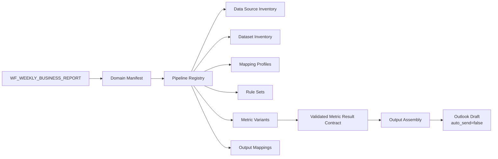
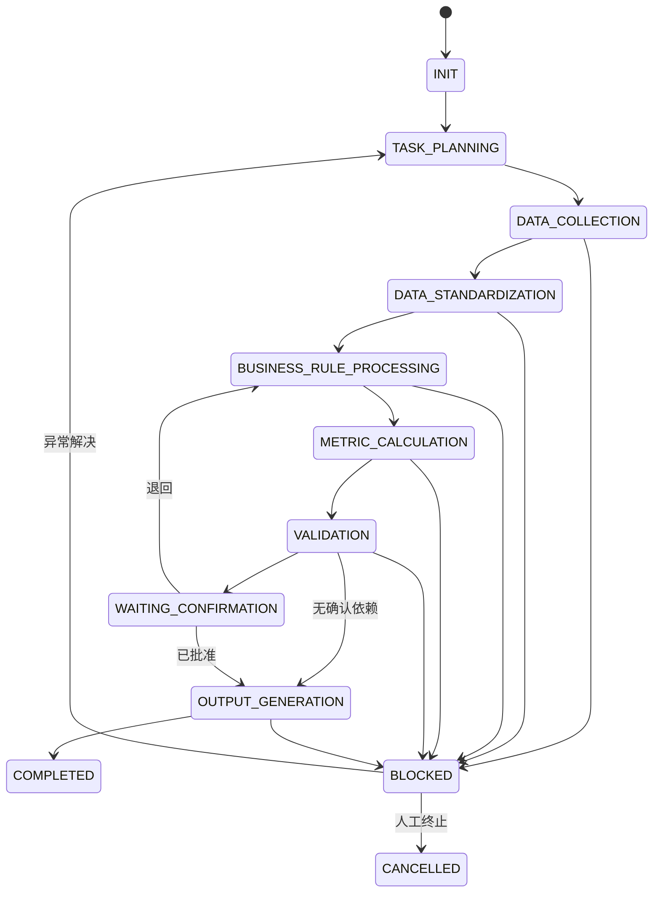

# Weekly Business Report Workflow v2

> Workflow_ID：`WF_WEEKLY_BUSINESS_REPORT`
>
> Version：`0.2.2-business-rule-initialization`
>
> Status：Approved Architecture / Pipeline Registry Completed / Original Field Mapping Gate Passed / Business Rule Initialization In Progress
>
> 旧版保留位置：`phase1/workflows/weekly_business_report/WORKFLOW.md`
>
> 当前阶段：不包含代码实现

## 1. Workflow 目标

编排 Weekly Business Report 所需的 Business Domain、Dataset Pipeline 和已验证 Metric Result，生成周报各业务模块及 Outlook Draft。

Workflow 不假设一个统一 Revenue Process 或 Inventory Process，也不依赖 Customer Revenue Excel 文件。

最终输出：

- Weekly Report Revenue Section。
- Weekly Report Inventory Section。
- 其他已配置业务模块。
- Outlook Draft，且 `auto_send=false`。
- 运行、验证、异常和血缘摘要。

## 2. 架构边界

### Workflow 负责

- 解析报告周期。
- 读取 Domain、Pipeline 和 Output Manifest。
- 按显式依赖调度 Pipeline。
- 管理 Workflow 与 Pipeline 状态。
- 检查 Required Pipeline 是否全部通过。
- 将已验证 Metric Result 交给 Output Assembly。

### Workflow 不负责

- 推断 Source–Dataset 或 Dataset–Pipeline 关系。
- 执行字段 Mapping、业务规则或指标公式。
- 根据名称或字段相似性选择 Metric Variant。
- 使用其他 Workflow 的输出文件作为依赖。

### Output Assembly 负责

- 结果组装。
- Output Mapping。
- 模板映射。
- 格式和文件生成。

### Output Assembly 不负责

- 数据计算。
- 业务规则判断。
- 指标选择或公式执行。
- 修正上游验证失败。

## 3. 资产依赖

所有依赖使用 ID 和 Version 显式引用。未显式登记的关系不能在运行时建立。

## 4. Domain Manifest

MVP 至少包含：

| Domain_ID | 说明 | 状态 |
|---|---|---|
| `DOMAIN_REVENUE` | 周报收入模块所需 Pipeline 集合 | Dataset/Pipeline 已初始化；原始Field Mapping范围已通过；Business Rule进行中 |
| `DOMAIN_INVENTORY` | 周报库存及相关经营指标 Pipeline 集合 | Dataset/Pipeline 已初始化；Field Mapping 待开始 |

Domain 只定义业务语义和 Pipeline 集合，不定义统一 Source、Schema 或 Formula。
Advertising 与 User Analytics / Platform Operation 的支持型 Pipeline 已在正式
Pipeline Registry 中显式登记，不因周报展示位置改变其业务归属。

## 5. Workflow 状态

## 6. Pipeline 是最小执行单元

每个 Pipeline 独立记录：

- `Pipeline_Run_ID`
- 当前通用阶段。
- 输入 Dataset 版本。
- Mapping、Rule、Metric Variant 和 Validation 版本。
- Required/Optional 属性。
- Attempt。
- 异常和补跑起点。

### Pipeline 状态矩阵

正式 Pipeline 清单、Required/Optional、依赖、失败范围及补跑规则以
`phase1_5/assets/pipelines/pipeline_registry.yaml`为唯一配置来源，本文不复制
运行配置。

| Registry状态 | Pipeline数量 | Field Mapping | Business Rules | Metric Variants | Output Mapping |
|---|---:|---|---|---|---|
| Completed / Readiness Gate Pass | 12 | Pending | Pending | Pending | Pending |

### 补跑规则

- Source 或获取失败：从 `DATA_COLLECTION` 补跑该 Pipeline。
- Mapping 修复：从 `DATA_STANDARDIZATION` 补跑该 Pipeline。
- Rule 修复：从 `BUSINESS_RULE_PROCESSING` 补跑该 Pipeline。
- Metric Variant 修复：从 `METRIC_CALCULATION` 补跑该 Pipeline。
- Output Mapping 修复：只重跑 Output Assembly；上游 Validated Result Contract 不变。
- 默认不重跑其他已成功 Pipeline。

跨 Pipeline 依赖导致下游结果失效时，只重跑显式依赖图中的受影响 Pipeline。

## 7. 通用 Pipeline 执行阶段

### DATA_COLLECTION

- 根据 Source_ID、Dataset_ID 和 Query_Asset_ID 获取输入。
- 验证来源、数据周期、刷新时间和唯一输入。
- 不解释字段业务含义。

### DATA_STANDARDIZATION

- 使用 Dataset 专属 Mapping_Profile_ID。
- 完成类型、标准字段、必需字段和 Schema 校验。
- 未知字段按配置创建异常；禁止自动匹配。

### BUSINESS_RULE_PROCESSING

- 按 Pipeline 中显式排序的 Rule_Set_ID 执行。
- Rule 未批准、适用 Context 不明确或版本冲突时阻断。

### METRIC_CALCULATION

- 只执行 Pipeline 显式引用的 Metric_Variant_ID。
- 不按 Metric_Name、产品名或历史结果自动选择公式。

### VALIDATION

- 执行 Dataset、Join、Rule、Metric 和跨 Pipeline 验证。
- 生成 Validated Metric Result Contract。

### OUTPUT_GENERATION

- 只消费 Validated Metric Result Contract。
- 根据 Output_Mapping_ID 生成周报模块和 Outlook Draft。
- 不重新计算指标。

## 8. Revenue Domain

Revenue Domain 包含多个 Revenue Dataset Pipeline。不同业务线可以拥有不同：

- Source。
- Dataset / Query Asset。
- Mapping Profile。
- Business Context。
- Rule Set。
- Metric Variant。

各 Pipeline 完成验证后，Revenue Section Assembly 才能组装结果。跨 Pipeline 汇总必须通过单位、周期、范围、维度和 Metric 兼容性验证。

## 9. Inventory Domain

Inventory Domain 按 Dataset / Query Asset 管理 Pipeline，不按平台拆分。一个公司平台可以提供：

- Inventory Dataset。
- Sell-through Dataset。
- DAU Dataset。
- Product Dataset。
- 其他 `TBD` Dataset。

以上只是 Dataset 类型占位，不代表已确认的真实资产。

## 10. Customer Revenue Detail 边界

`WF_CUSTOMER_REVENUE_DETAIL` 是独立 Workflow：

- 独立 Source、Dataset、Pipeline、Rule、Metric Variant 和 Output Mapping。
- 生成 Customer Revenue Excel。
- 与 Weekly Workflow 不产生文件级依赖。
- 如需共享，通过 Metrics Store 或 Validated Metric Result Contract。
- Weekly Workflow 不检查 Customer Revenue Excel 是否已生成。

## 11. Required 与 Optional Pipeline

- Required：失败时阻断相关周报模块或整个输出，具体范围显式配置。
- Optional：缺失时是否允许输出、如何标注必须预先配置。
- Agent 不得临时将 Required 改为 Optional。
- 当前清单已在 Pipeline Registry 中确认：

| Pipeline_ID | 分类 | 失败影响范围 |
|---|---|---|
| `PL_REVENUE_TECHNICAL_WEEKLY` | Required | Weekly Report Revenue Section only |
| `PL_REVENUE_CTV_WEEKLY` | Required | Weekly Report Revenue Section only |
| `PL_REVENUE_SMART_SPEAKER_WEEKLY` | Required | Weekly Report Revenue Section only |
| `PL_REVENUE_FAST_VERSION_WEEKLY` | Required | Weekly Report Revenue Section only |
| `PL_INVENTORY_FULL_SITE_WEEKLY` | Required | Weekly Report Inventory Section only |
| `PL_INVENTORY_PATCH_WEEKLY` | Required | Weekly Report Inventory Section only |
| `PL_INVENTORY_NON_PATCH_PRODUCT_WEEKLY` | Required | Weekly Report Inventory Section only |
| `PL_ADVERTISING_BRAND_MOMENT_DELIVERY_WEEKLY` | Required | Brand Moment sell-through result only |
| `PL_INVENTORY_BRAND_MOMENT_SELL_THROUGH_WEEKLY` | Required | Brand Moment sell-through result only |
| `PL_INVENTORY_PRODUCT_SELL_THROUGH_WEEKLY` | Required per configured report product | Target product sell-through result only |
| `PL_USER_ANALYTICS_PLATFORM_DAU_WEEKLY` | Optional | Weekly Report DAU summary content only |
| `PL_ADVERTISING_PRODUCT_CUSTOMER_CHANGE_ANALYSIS` | Optional / Conditional | Triggered product customer explanation only |

Pipeline运行时不得以本文表格代替正式Registry；若二者不一致，以正式Registry为准。

## 12. Output Assembly Contract

输入：

- Validated Metric Result Contract。
- Output_Mapping_ID 和 Version。
- Template_ID 和 Version。
- 报告周期。
- 已批准的展示配置。

输出：

- 周报 Section。
- Outlook Draft。
- 输出校验摘要。

硬性控制：

- 只接受 `validation_status=passed` 且满足批准要求的结果。
- 找不到唯一 Output Mapping 时阻断。
- 模板必填占位符未填充时阻断。
- `auto_send=false` 不允许由 Workflow 配置覆盖。

## 13. Workflow 间结果共享

Workflow 之间只能通过：

- Metrics Store。
- Validated Metric Result Contract。

共享结果至少包含：

- Producer Workflow_ID / Run_ID。
- Pipeline_ID / Version。
- Dataset、Context、Rule、Metric Variant 版本。
- 报告周期。
- Validation 和 Approval Status。
- Result_ID、Value、Unit、Dimensions。
- Generation Time。

禁止共享：

- 依赖另一个 Workflow 的 Excel、PPT、Word 或邮件文件。
- 未验证中间结果。
- 无血缘或版本信息的指标值。

## 14. 异常处理

异常首先定位到：

`Pipeline_Run_ID → Stage → Asset_ID / Version`

Workflow 级异常只用于：

- 周期定义不可解析。
- Domain/Pipeline Manifest 无效。
- Required Pipeline 依赖图冲突。
- Output Assembly 无法完成。

字段、Dataset、Rule 和 Metric 异常默认归属具体 Pipeline。

## 15. 验收条件

- 同一 Source 可登记多个 Dataset。
- Dataset–Pipeline 多对多依赖全部显式配置。
- Pipeline 可独立运行、验证和补跑。
- 同名 Metric 可绑定多个 Metric Variant，但运行时引用唯一。
- Output Assembly 不包含公式或业务规则。
- Customer Revenue Detail 与 Weekly Workflow 无文件级依赖。
- Outlook 只创建 Draft，`auto_send=false`。
